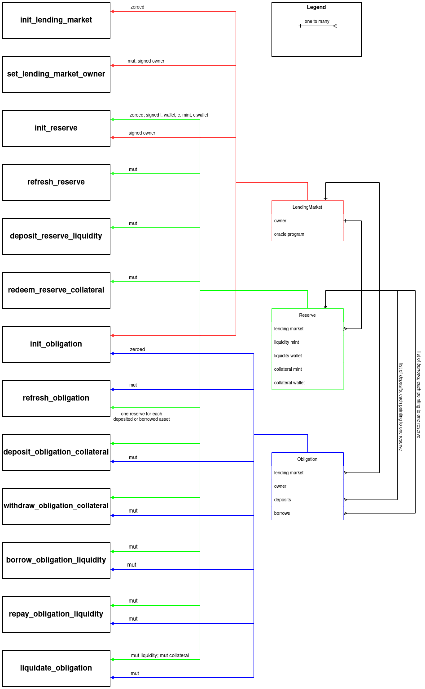
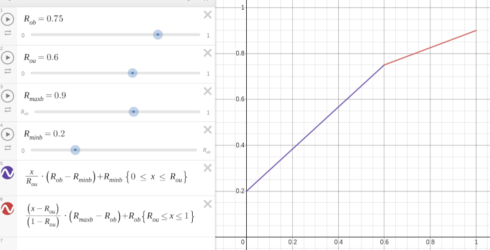

* [View Rust docs][project-rust-docs]

## Design
The Borrow-Lending program (BLp) is a set of actions (endpoints) each belonging
to one of 4 permission levels. BLp operates on 3 kinds of owned accounts, 2
kinds of oracle accounts and 2 kinds of token accounts.

The permission levels are: _(i)_ market owner who controls what assets
(reserves) are available to borrow and various configuration such as fees,
interest rates, etc; _(ii)_ funder who deposits liquidity into one or more of
market's reserves; _(iii)_ borrower who collateralizes their assets in exchange
for another; _(iv)_ public, i.e. anyone can call a public action without
signing the transaction.

The owned accounts are: _(i)_ lending market which is a "root" account in the
sense that all other accounts reference it. Created and owned by the market
owner permission level. It contains information about the _universal asset
currency_ (UAC) which serves as a common denominator when appreciating
liquidities.  All reserves must use token for which the oracle has market
price. An example of UAC is USD. _(ii)_ Reserve which is a token listing. By
adding reserves to a market we allow funders to deposit their liquidity and
borrowers to then borrow this liquidity.  Reserve is associated with some
external liquidity token mint and owns a token wallet of that liquidity mint.
Reserve creates its own mint for collateral and owns a token wallet of that
collateral mint. _(iii)_ Obligation which is a borrower's receipt about what
assets they deposited as collateral and what assets they borrowed. The market
value in UAC is periodically recalculated in a public action.

The oracle accounts maintained by [Pyth][pyth-network] are: _(i)_ product
settings which holds basic information about two currencies, one of which is
UAC and the other reserve token mint. In itself not very important account.
_(ii)_ Exchange price which is frequently updated by the oracle program. For
example, should the market owner add a reserve SRM, then the oracle provides
[information about SRM/USD price][pyth-srm-usd].

The token accounts are: _(i)_ mint some of which are owned by the BLp (reserve
collateral) and some of which are referenced only via pubkey (liquidity);
_(ii)_ wallet which are used to transfer and hold funds.

Let's have a look at BLp from the user's perspective.

A funder deposits reserve liquidity by transferring tokens from their source
wallet to the reserve's supply wallet which holds funds of all funders
together. In return, BLp mints appropriate amount of reserve's collateral
tokens into funder's destination collateral wallet. The exchange rate between
liquidity and collateral starts at 1:5 when no collateral is minted, and given
by [eq. 2](#equations) when the circulating amount of collateral is not 0.
Because borrowers pay interest on their loans, the amount of liquidity in the
reserve's supply wallet increases which makes the ratio more favorable for the
minted collateral. Eventually, the funder redeems their minted collateral for
more liquidity than they deposited. BLp burns the redeemed collateral tokens.

A user becomes a borrower upon creating a new obligation account. In order to
borrow the obligation collateral market value in UAC must be higher (by a
configurable percentage) than the obligation liquidity market value in UAC. In
order to deposit collateral to the obligation, the borrower must first obtain a
collateral token of one of available reserves listed for the market. The most
straightforward way to obtain some collateral token is to become a funder. In
short, a borrower funds liquidity A for which they receive collateral A'. They
deposit A' to the obligation and then they can borrow liquidity B. The borrower
is able to withdraw A' as long as they deposit yet another collateral or repay
B.

A liquidator is a user who actions on under-collateralized obligations. It's a
public action, therefore any block-chain user can be a liquidator. Not the
whole obligation can be liquidated at once. With each liquidation call only
half of the obligation is liquidated in such a manner that the market value of
collateral approaches market value of liquidity plus the necessary
over-collateralized percentage. The liquidator pays a liquidity which is
borrowed by an obligation and receives collateral in exchange. To make this
profitable for the liquidator, the market price of the liquidity is multiplied
by a liquidation bonus configurable value.

TODO: cross-reference with equations


<details>
<summary markdown="span">
Diagram illustrating endpoints-accounts relationships
</summary>



</details>

### Reserve configuration
When market owner creates a reserve, they supply configuration with (not only)
following information:

* `optimal_utilization_rate` is $`R^*_u`$, see below;
* `optimal_borrow_rate` is $`R^*_b`$, see below;
* `loan_to_value_ratio` is a percentage by which obligation must be
  over-collateralized to make further borrowing possible;
* `liquidation_threshold` is a percentage by which obligation must be
  over-collateralized to avoid liquidation;
* `min_borrow_rate` is $`R_{minb}`$, see below;
* `max_borrow_rate` is $`R_{maxb}`$, see below;

#### Fees
Upon calling the borrow action the caller can provide up to two wallets which
are used for fee collection.

The main fee receiver wallet is mandatory and its pubkey is configured on
reserve's initialization. When liquidity is borrowed this wallet receives a
fraction of that borrow defined by `borrow_fee` reserve configuration
percentage value.

An optional host fee receiver wallet is defined as a remaining account and can
be any valid borrowed liquidity wallet (pubkey not conditioned by reserve's
config). If provided it receives a fraction of the borrow defined by `host_fee`
reserve configuration percentage value.

The minimum fee is 1 liquidity token's smallest divisible part (e.g. 1 sat for
XBT).

### Borrow rate
Borrow rate ($`R_b`$) is a key concept for interest calculation. TODO: explain
the model

<details>
<summary markdown="span">Model for borrow rate calculation (eq. 3)</summary>

[][desmos-borrow-rate]

_Legend_: subscript `o` in the image means optimal while in this document we
use superscript `*`; the x axis represents $`R_u`$.

</details>

### Equations
Search for `ref. eq. (x)` to find an equation _x_ in the codebase.

| Symbol       | Description |
|---           |--- |
| $`L_b`$      | total borrowed liquidity (of reserve or obligation) |
| $`L_s`$      | total deposited liquidity supply |
| $`L_o`$      | borrowed liquidity for obligation |
| $`L_v`$      | UAC value of borrowed liquidity |
| $`L_{maxl}`$ | maximum liquidity amount to liquidate |
| $`C_s`$      | total minted collateral supply |
| $`S_e`$      | elapsed slots |
| $`S_a`$      | number of slots in a calendar year |
| $`R_u`$      | utilization rate |
| $`R_x`$      | exchange rate |
| $`R_b`$      | borrow rate |
| $`R_c`$      | cumulative borrow rate |
| $`R_i`$      | compound interest rate |
| $`R^*_u`$    | optimal utilization rate (configurable) |
| $`R^*_b`$    | optimal borrow rate (configurable) |
| $`R_{minb}`$ | minimum $`R_b`$ (configurable) |
| $`R_{maxb}`$ | maximum $`R_b`$ (configurable) |
| $`V_d`$      | UAC value of deposited collateral |
| $`V_b`$      | UAC value of borrowed liquidity |
| $`V_{maxw}`$ | maximum withdrawable UAC value |
| $`V_{maxb}`$ | maximum borrowable UAC value (against deposited collateral) |
| $`κ`$        | constant liquidity close factor |


```math
R_u = \dfrac{L_b}{L_s}
\tag{1}
```


Exchange rate is simply ratio of collateral to liquidity in the supply. However,
if there's no liquidity or collateral in the supply, the ratio defaults to a
compiled-in value.

```math
R_x = \dfrac{C_s}{L_s}
\tag{2}
```


See the docs in [borrow rate section](#borrow-rate).

```math
R_b =
\begin{cases}
    \dfrac{R_u}{R^*_u} (R^*_b - R_{minb}) + R_{minb},
    & \text{if } R_u < R^*_u\\[3.5ex]
    \dfrac{R_u - R^*_u}{1 - R^*_u} (R_{maxb} - R^*_b) + R^*_b,
    & \text{otherwise}
\end{cases}
\tag{3}
```


We define the compound interest period to equal one slot. To get the `i`
parameter of the standard [compound interest formula][compound-interest-formula]
we divide borrow rate by the number of slots per year:

```math
R_i = (1 + \dfrac{R_b}{S_a})^{S_e}
\tag{4}
```


Once per slot we update the liquidity supply with interest rate:

```math
L^{'}_s = L_s R_i
\tag{5}
```


Eq. (6) describes how interest accrues on borrowed liquidity. $`R^{'}_c`$ is
the latest cum. borrow rate at time of update while $`R_c`$ is the cum. borrow
rate at time of last interest accrual.

```math
L^{'}_o = \dfrac{R^{'}_c}{R_c} L_o
\tag{6}
```


Maximum UAC value to withdraw from an obligation is given by a ratio of
borrowed value to maximum allowed borrow value:

```math
V_{maxw} = V_d - \dfrac{V_b}{V_{maxb}} V_d
\tag{7}
```


Eq. (8) gives us maximum liquidation amount of liquidity which a liquidator
cannot go over. (Although they can liquidate less than that.) The close factor
$`κ`$ is 50% (compiled into the program) and puts a limit on how much borrowed
value can be liquidated at once.

```math
L_{maxl} = \dfrac{\min\{V_b * κ, L_v\}}{L_v} L_b
\tag{8}
```

## Commands
Use following anchor command to build the `borrow-lending` program:

```
anchor build
```

Use testing script to build dependencies for testing (such as `shmem`)
and run the tests:

```
./bin/test.sh [--detach] [--skip-build]
```

When debugging or working on a new feature, use
[mocha's `only`][mocha-exclusive-tests] functionality to avoid running all tests
every time.

## CLI
To ease BLp setup on devnet and mainnet, this repository provides a simple CLI
which can be configured to call actions on the chain.

First, you must build the CLI binary. (You will need to have `libssl-dev` and
`libudev-dev` installed.)

```
cargo build --bin cli --release
```

Then you can either setup an .env file by cloning and editing the example:

```
cp cli/.env.example .env
```

or you can view help for command line configuration options:

```
./target/release/cli help
```

A handy command to generate new keypair for setting up new accounts:

```
solana-keygen new -o [file-name].json
```

To try the CLI locally you run the test ledger and configure localnet either
with `--cluster` flag or `CLUSTER` environment variable.

```
solana-test-validator
```

For example, after creating necessary keypairs and setting up .env, one can
create a new lending market with:

```
./target/release/cli init-market \
  --keypair market-keypair.json \
  --owner owner-keypair.json \
  --usd
```


[desmos-borrow-rate]: https://www.desmos.com/calculator/1002gfizz0
[compound-interest-formula]: https://en.wikipedia.org/wiki/Compound_interest#Periodic_compounding
[mocha-exclusive-tests]: https://mochajs.org/#exclusive-tests
[pyth-network]: https://pyth.network
[pyth-srm-usd]: https://pyth.network/markets/#SRM/USD
[project-rust-docs]: https://crypto_project.gitlab.io/defi/borrow-lending/borrow_lending
