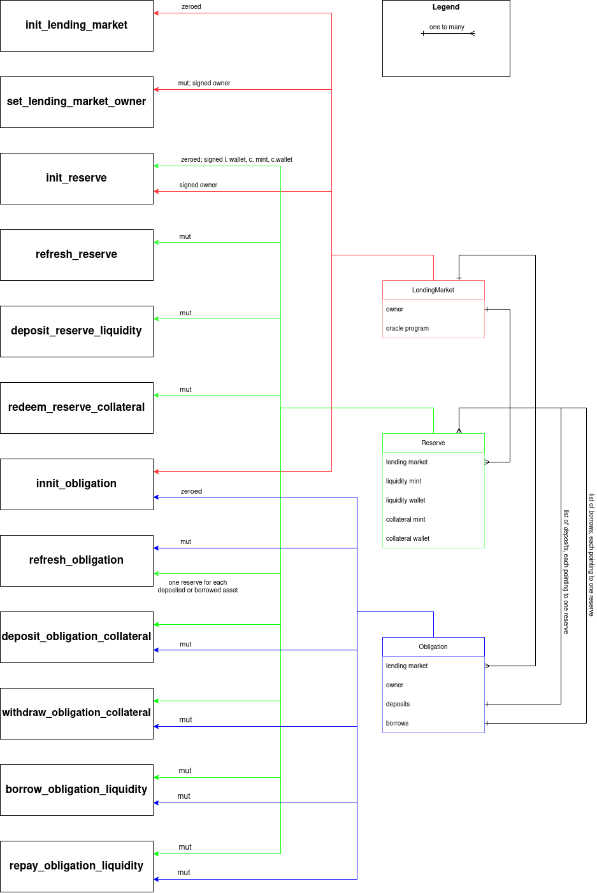

# borrow-lending

## Design
<details>
<summary markdown="span">Diagram illustrating endpoints-accounts relationship</summary> 
    


</details>

TODO

## Building
Use following anchor command to build the `borrow-lending` program:

```
anchor build
```

## Testing
Use testing script to build dependencies for testing (such as `shmem`)
and run the tests:

```
./test.sh
```
