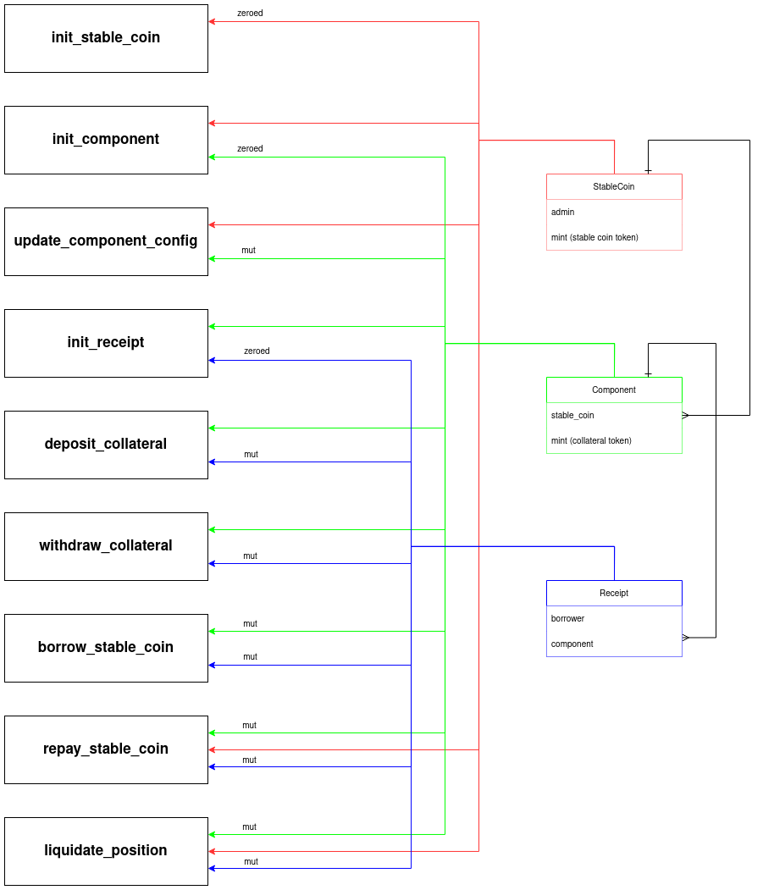

* [Borrow lending program][blp]
* [Changelog][project-changelog]


## Design

<details>
<summary markdown="span">
Diagram illustrating endpoints-accounts relationships
</summary>



</details>

The admin inits new stable coin and then inits components, which are a way to
represent different token mints. A component is associated with BLp's reserve.
This allows us to use the oracle implementation from BLp without having to use
any of the oracle code. Another advantage is that we can use BLp's reserve
collateral mint for a component. It will be calculated with the exchange ratio
method on the reserve account.

A user first creates their own receipt for each different type of collateral
(component) they want to use to mint the stable coin. Then they deposit their
tokens into the program, them being transferred to a freeze wallet and the
receipt's collateral amount, and thereby allowance, increased.

User can borrow stable coin. The endpoint mints provided amount so long as the
receipt stays _healthy_, ie. the collateral market value scaled down by max
collateral ratio is larger than the loan.

Borrow fee is added and the whole amount undergoes interest accrual. The
interest is static and APR, that's why we store borrowed amount and interest
amount separately.

The user can then repay stable coin. The endpoint burns USP from user's wallet.
If partial repay is done, we first repay the interest and then the borrowed
amount.

In the end, the user can withdraw collateral as long as the receipt remains
healthy.


## Liquidation

The liquidator must liquidate the whole position at once, at the moment we
don't offer partial liquidation. The provide the program with USP, which is
burned, and in return receive collateral at a discounted market price. Part of
this additional collateral is transferred to a fee wallet owned by the admin.

### Example
Say a SOL component's receipt has deposited 4 SOL. Market price of SOL is $100.
The max collateral ratio is 90%. The user has borrowed $120 when the SOL market
price was more favorable. Now, their position is unhealthy.

The discounted market price is $87.5 (ie. liquidation bonus is 12.5%). The
position will be deducted $120/$87.5 ~= 1.37 SOL. Without the discount this
would be 1.2 SOL. The liquidator "wins" ~0.17 SOL. However, they must pay a
platform fee on this.

The liquidation acts as a repayment of sorts. At the end, the receipt will
contain ~2.63 SOL, the liquidator receives 0.153 SOL and the platform (us)
0.017 SOL (ie. liquidation fee is 10%).

## Leverage
We have action for following otherwise laborious process:
1. user deposits collateral
2. user borrows USP
3. user swaps USP into USDC
4. user swaps USDC into collateral
5. user goes back to step 1.

The process above can be repeated by the user several times, depending on
what's the maximum collateral ratio for the component. The
`leverage_on_aldrin_amm` endpoint calculates how much USP would be minted for
how much collateral, and performs all of the above in a single instruction.

The user gives us collateral ratio at which they want to perform this
operation, where maximum they can provide is the maximum set in the component's
config. The closer to the configured maximum, the higher is the risk of
liquidation for the user. Second argument is the initial amount. The user must
already have deposited enough collateral to cover the initial amount. The user
also provides slippage information for both swaps.

## Equations
Search for `ref. eq. (x)` to find an equation _x_ in the codebase.


| Symbol       | Description |
|---           |--- |
| $`L`$        | leverage |
| $`R_u`$      | user selected collateral ratio  |

⌐

The leverage is a number which multiplies the initial user's deposit to find
the end amount of USP which will be minted, added to user's borrow amount and
then swapped into collateral.
```math
L = \dfrac{1 - R_u^30}{1 - R_u}
\tag{1}
```

⌙

<!-- References -->
[blp]: https://crypto_project.gitlab.io/perk/borrow-lending/index.html
[project-changelog]: https://crypto_project.gitlab.io/perk/borrow-lending/scp.changelog.html
