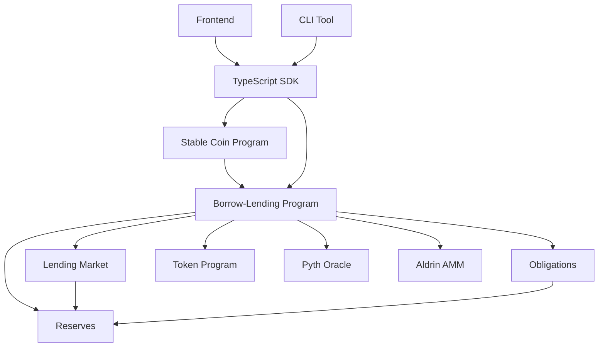

# Developer Guide

This guide helps developers get started with the Solana Borrow-Lending Protocol, understand its architecture, and integrate with the platform.

## Table of Contents

1. [Quick Start](#quick-start)
2. [Environment Setup](#environment-setup)
3. [Architecture Overview](#architecture-overview)
4. [Core Components](#core-components)
5. [Program Structure](#program-structure)
6. [Testing](#testing)
7. [Integration Examples](#integration-examples)
8. [Best Practices](#best-practices)
9. [Debugging](#debugging)

## Quick Start

Get up and running with the protocol in 5 minutes:

### 1. Clone and Install

```bash
git clone https://github.com/aldrin-labs/solana-borrow-lending.git
cd solana-borrow-lending
yarn install
```

### 2. Set Up Environment

```bash
# Copy environment template
cp .env.example .env

# Edit .env with your configuration
# CLUSTER=localnet
# ANCHOR_WALLET=/path/to/your/keypair.json
```

### 3. Build the Project

```bash
# Build all programs
anchor build

# Generate IDL files (for TypeScript types)
anchor build --idl target/idl
```

### 4. Run Tests

```bash
# Start local validator (in separate terminal)
solana-test-validator

# Run tests
anchor test --skip-local-validator
```

### 5. Basic Integration

```typescript
import * as anchor from "@project-serum/anchor";
import { Program } from "@project-serum/anchor";
import { BorrowLending } from "../target/types/borrow_lending";

// Initialize program
const provider = anchor.AnchorProvider.env();
anchor.setProvider(provider);
const program = anchor.workspace.BorrowLending as Program<BorrowLending>;

// Your first transaction
const lendingMarket = anchor.web3.Keypair.generate();
await program.rpc.initLendingMarket(/* params */);
```

## Environment Setup

### Prerequisites

Ensure you have the following installed:

- **Rust** (latest stable): [Install Rust](https://rustup.rs/)
- **Solana CLI** (v1.9.18+): [Install Solana](https://docs.solana.com/cli/install-solana-cli-tools)
- **Anchor** (v0.24.2): [Install Anchor](https://project-serum.github.io/anchor/getting-started/installation.html)
- **Node.js** (v16+): [Install Node.js](https://nodejs.org/)
- **Yarn**: `npm install -g yarn`

### Installation Commands

```bash
# Install Rust
curl --proto '=https' --tlsv1.2 -sSf https://sh.rustup.rs | sh

# Install Solana CLI
sh -c "$(curl -sSfL https://release.solana.com/v1.9.18/install)"

# Install Anchor
npm install -g @project-serum/anchor-cli

# Verify installations
rust --version
solana --version
anchor --version
node --version
yarn --version
```

### Development Environment

Set up your development environment:

```bash
# Generate a keypair for development
solana-keygen new -o ~/.config/solana/id.json

# Set CLI configuration
solana config set --url localhost
solana config set --keypair ~/.config/solana/id.json

# Fund your account on devnet
solana airdrop 10
```

### IDE Setup

#### VS Code Extensions (Recommended)

- **rust-analyzer**: Rust language support
- **Solana/Anchor Snippets**: Code snippets for Solana/Anchor
- **Better TOML**: TOML file support
- **TypeScript Hero**: TypeScript support

#### Settings

Create `.vscode/settings.json`:

```json
{
  "rust-analyzer.cargo.features": ["test-bpf"],
  "rust-analyzer.checkOnSave.command": "clippy",
  "rust-analyzer.checkOnSave.extraArgs": ["--", "-W", "clippy::all"],
  "files.associations": {
    "*.rs": "rust"
  },
  "typescript.preferences.importModuleSpecifier": "relative"
}
```

## Architecture Overview

### High-Level Design

The Solana Borrow-Lending Protocol consists of:

```
┌─────────────────┐    ┌─────────────────┐    ┌─────────────────┐
│   Frontend UI   │    │   TypeScript    │    │      CLI        │
│     (React)     │    │       SDK       │    │     Tool        │
└─────────────────┘    └─────────────────┘    └─────────────────┘
         │                       │                       │
         └───────────────────────┼───────────────────────┘
                                 │
         ┌───────────────────────────────────────────────┐
         │              RPC/Web3 Layer                   │
         └───────────────────────────────────────────────┘
                                 │
         ┌───────────────────────────────────────────────┐
         │            Solana Blockchain                  │
         │  ┌─────────────────┐  ┌─────────────────┐     │
         │  │ Borrow-Lending  │  │  Stable Coin    │     │
         │  │    Program      │  │    Program      │     │
         │  └─────────────────┘  └─────────────────┘     │
         │           │                     │             │
         │  ┌─────────────────┐  ┌─────────────────┐     │
         │  │  Token Program  │  │ Pyth Oracle     │     │
         │  └─────────────────┘  └─────────────────┘     │
         └───────────────────────────────────────────────┘
```

### Program Relationships



### Data Flow

1. **User Actions** → TypeScript SDK → RPC calls → Solana Programs
2. **Price Updates** → Pyth Oracle → Reserve refresh → Interest calculation
3. **Liquidations** → Health monitoring → Liquidator bots → Liquidation transactions

## Core Components

### 1. Lending Market

The root account that manages global settings:

```rust
#[account]
pub struct LendingMarket {
    pub version: u8,
    pub bump_seed: u8,
    pub owner: Pubkey,
    pub quote_currency: [u8; 32],           // e.g., "USD"
    pub token_program_id: Pubkey,
    pub oracle_program_id: Pubkey,
    pub flash_loans_enabled: bool,
    pub leveraged_compound_fee: PercentageInt,
    pub vault_compound_fee: PercentageInt,
    pub min_collateral_uac_value_for_leverage: SDecimal,
}
```

**Key Features:**
- Market-wide configuration
- Flash loan enable/disable
- Fee structure
- Oracle integration

### 2. Reserve

Represents a token pool for lending/borrowing:

```rust
#[account(zero_copy)]
pub struct Reserve {
    pub version: u8,
    pub lending_market: Pubkey,
    pub liquidity: ReserveLiquidity,
    pub collateral: ReserveCollateral,
    pub config: ReserveConfig,
    pub last_update: LastUpdate,
}
```

**Key Features:**
- Token-specific configuration
- Interest rate calculation
- Liquidity and collateral management
- Oracle price integration

### 3. Obligation

Tracks user positions (deposits + borrows):

```rust
#[account(zero_copy)]
pub struct Obligation {
    pub version: u8,
    pub lending_market: Pubkey,
    pub owner: Pubkey,
    pub deposits: [ObligationCollateral; MAX_OBLIGATION_RESERVES],
    pub borrows: [ObligationLiquidity; MAX_OBLIGATION_RESERVES],
    pub deposited_value: Decimal,
    pub borrowed_value: Decimal,
    pub allowed_borrow_value: Decimal,
    pub unhealthy_borrow_value: Decimal,
    pub last_update: LastUpdate,
}
```

**Key Features:**
- Multi-asset collateral
- Multi-asset borrowing
- Health factor tracking
- Liquidation monitoring

## Program Structure

### Directory Layout

```
programs/
├── borrow-lending/
│   ├── src/
│   │   ├── lib.rs              # Main program entry point
│   │   ├── endpoints/          # Instruction handlers
│   │   │   ├── init_lending_market.rs
│   │   │   ├── init_reserve.rs
│   │   │   ├── deposit_reserve_liquidity.rs
│   │   │   ├── borrow_obligation_liquidity.rs
│   │   │   └── ...
│   │   ├── models/            # Data structures
│   │   │   ├── lending_market.rs
│   │   │   ├── reserve.rs
│   │   │   ├── obligation.rs
│   │   │   └── ...
│   │   ├── math/              # Mathematical calculations
│   │   │   ├── decimal.rs
│   │   │   ├── interest.rs
│   │   │   └── ...
│   │   └── err.rs             # Error definitions
│   └── Cargo.toml
└── stable-coin/
    └── ... (similar structure)
```

### Key Modules

#### `lib.rs` - Program Entry Point

Defines all public instructions:

```rust
#[program]
pub mod borrow_lending {
    use super::*;

    pub fn init_lending_market(
        ctx: Context<InitLendingMarket>,
        currency: UniversalAssetCurrency,
        // ... other params
    ) -> Result<()> {
        endpoints::init_lending_market::handle(ctx, currency, /* ... */)
    }

    // ... other instructions
}
```

#### `endpoints/` - Instruction Handlers

Each file handles a specific instruction:

```rust
// endpoints/deposit_reserve_liquidity.rs
use crate::prelude::*;

#[derive(Accounts)]
pub struct DepositReserveLiquidity<'info> {
    #[account(mut)]
    pub source_liquidity_wallet: AccountInfo<'info>,
    // ... other accounts
}

pub fn handle(
    ctx: Context<DepositReserveLiquidity>,
    liquidity_amount: u64,
) -> Result<()> {
    // Implementation
}
```

#### `models/` - Data Structures

```rust
// models/reserve.rs
#[zero_copy]
#[derive(Debug)]
pub struct Reserve {
    // Field definitions
}

impl Reserve {
    pub fn new(/* params */) -> Self { /* ... */ }
    pub fn calculate_interest(&mut self) -> Result<()> { /* ... */ }
    // ... other methods
}
```

#### `math/` - Mathematical Operations

```rust
// math/decimal.rs
#[derive(Clone, Copy, Debug, PartialEq)]
pub struct Decimal(pub U256);

impl Decimal {
    pub fn from(value: u64) -> Self { /* ... */ }
    pub fn try_add(&self, other: Self) -> Result<Self> { /* ... */ }
    // ... other operations
}
```

### Testing Structure

```
tests/
├── src/
│   ├── index.ts                    # Test entry point
│   ├── global-container.ts         # Shared test state
│   ├── utils/                      # Test utilities
│   ├── vanilla/                    # Basic functionality tests
│   │   ├── 1-init-lending-market.ts
│   │   ├── 2-init-reserve.ts
│   │   └── ...
│   └── stable-coin/               # Stable coin tests
│       └── ...
└── fixtures/                      # Test data
```

## Testing

### Running Tests

```bash
# Build and run all tests
anchor test

# Run specific test file
anchor test tests/src/vanilla/1-init-lending-market.ts

# Skip build (if already built)
anchor test --skip-build

# Run with debugging
RUST_LOG=debug anchor test
```

### Test Structure

Tests are organized by functionality:

```typescript
// tests/src/vanilla/1-init-lending-market.ts
import { expect } from "chai";
import { globalContainer } from "../global-container";

export function test() {
  it("initializes lending market", async () => {
    const { blp, payer } = globalContainer;
    
    const lendingMarket = anchor.web3.Keypair.generate();
    
    await blp.rpc.initLendingMarket(
      { usd: {} },
      new anchor.BN(50),
      new anchor.BN(50),
      [new anchor.BN(1000), new anchor.BN(0), new anchor.BN(0)],
      {
        accounts: {
          lendingMarket: lendingMarket.publicKey,
          marketOwner: payer.publicKey,
          pdaSigner: pdaAddress,
          systemProgram: anchor.web3.SystemProgram.programId,
        },
        signers: [lendingMarket, payer],
      }
    );
    
    const market = await blp.account.lendingMarket.fetch(
      lendingMarket.publicKey
    );
    expect(market.owner.equals(payer.publicKey)).to.be.true;
  });
}
```

### Writing Tests

#### Best Practices

1. **Use descriptive test names**
2. **Test one concept per test**
3. **Clean up state between tests**
4. **Use meaningful assertions**
5. **Test both success and error cases**

#### Example Test

```typescript
export function test() {
  describe("reserve operations", () => {
    let reserve: PublicKey;
    let lendingMarket: PublicKey;
    
    beforeEach(async () => {
      // Setup fresh state
      ({ reserve, lendingMarket } = await setupReserve());
    });
    
    it("allows liquidity deposit", async () => {
      const depositAmount = 1000;
      
      const tx = await program.rpc.depositReserveLiquidity(
        new anchor.BN(depositAmount),
        {
          accounts: {
            // ... accounts
          },
          signers: [user],
        }
      );
      
      // Verify state changes
      const reserveAccount = await program.account.reserve.fetch(reserve);
      expect(reserveAccount.liquidity.availableAmount.toNumber())
        .to.equal(depositAmount);
    });
    
    it("fails with insufficient funds", async () => {
      const excessiveAmount = 999999999;
      
      try {
        await program.rpc.depositReserveLiquidity(
          new anchor.BN(excessiveAmount),
          { /* accounts */ }
        );
        expect.fail("Should have thrown an error");
      } catch (error) {
        expect(error.message).to.include("Insufficient funds");
      }
    });
  });
}
```

## Integration Examples

### Basic SDK Usage

```typescript
import { BorrowLendingSDK } from "./sdk";

// Initialize SDK
const sdk = new BorrowLendingSDK({
  connection: new Connection("https://api.devnet.solana.com"),
  wallet: walletAdapter,
  programId: BORROW_LENDING_PROGRAM_ID,
});

// Create lending market
const market = await sdk.createLendingMarket({
  currency: "USD",
  leveragedCompoundFee: 0.5, // 0.5%
  vaultCompoundFee: 0.5,     // 0.5%
});

// Add reserve
const reserve = await sdk.addReserve(market.publicKey, {
  tokenMint: USDC_MINT,
  optimalUtilizationRate: 80,
  loanToValueRatio: 75,
  liquidationThreshold: 85,
  liquidationBonus: 5,
});

// User operations
await sdk.depositLiquidity(reserve.publicKey, 1000);
await sdk.borrowLiquidity(obligation.publicKey, reserve.publicKey, 750);
```

### React Integration

```typescript
// hooks/useBorrowLending.ts
import { useConnection, useWallet } from "@solana/wallet-adapter-react";
import { BorrowLendingSDK } from "../sdk";

export function useBorrowLending() {
  const { connection } = useConnection();
  const wallet = useWallet();
  
  const sdk = useMemo(() => {
    if (!wallet.publicKey) return null;
    
    return new BorrowLendingSDK({
      connection,
      wallet,
      programId: PROGRAM_ID,
    });
  }, [connection, wallet]);
  
  return {
    sdk,
    depositLiquidity: async (reserveId: string, amount: number) => {
      if (!sdk) throw new Error("Wallet not connected");
      return sdk.depositLiquidity(new PublicKey(reserveId), amount);
    },
    // ... other methods
  };
}

// Component usage
function LendingInterface() {
  const { sdk, depositLiquidity } = useBorrowLending();
  const [amount, setAmount] = useState("");
  
  const handleDeposit = async () => {
    try {
      await depositLiquidity(reserveId, parseFloat(amount));
      toast.success("Deposit successful!");
    } catch (error) {
      toast.error(`Deposit failed: ${error.message}`);
    }
  };
  
  return (
    <div>
      <input 
        value={amount} 
        onChange={(e) => setAmount(e.target.value)}
        placeholder="Amount to deposit"
      />
      <button onClick={handleDeposit}>
        Deposit
      </button>
    </div>
  );
}
```

### CLI Integration

```typescript
// cli/commands/deposit.ts
import { Command } from "commander";
import { BorrowLendingSDK } from "../sdk";

export const depositCommand = new Command("deposit")
  .description("Deposit liquidity into a reserve")
  .requiredOption("-r, --reserve <pubkey>", "Reserve public key")
  .requiredOption("-a, --amount <number>", "Amount to deposit")
  .requiredOption("-u, --user <path>", "User keypair file")
  .action(async (options) => {
    const userKeypair = loadKeypair(options.user);
    const sdk = new BorrowLendingSDK({
      connection: getConnection(),
      wallet: { publicKey: userKeypair.publicKey },
      programId: PROGRAM_ID,
    });
    
    try {
      const tx = await sdk.depositLiquidity(
        new PublicKey(options.reserve),
        parseFloat(options.amount)
      );
      
      console.log(`Deposit successful! Transaction: ${tx}`);
    } catch (error) {
      console.error(`Deposit failed: ${error.message}`);
      process.exit(1);
    }
  });
```

## Best Practices

### Code Organization

1. **Separate concerns**: Keep instruction logic, data structures, and math in separate modules
2. **Use type safety**: Leverage Rust's type system and Anchor's account validation
3. **Document public APIs**: Add comprehensive doc comments to public functions
4. **Handle errors gracefully**: Use custom error types and meaningful error messages

### Security Considerations

1. **Validate all inputs**: Never trust user input, always validate
2. **Check account ownership**: Ensure accounts are owned by expected programs
3. **Use PDAs appropriately**: For accounts that need program authority
4. **Audit math operations**: Financial calculations must be precise and overflow-safe

### Performance Optimization

1. **Minimize account data**: Use packed structs and bit flags where appropriate
2. **Batch operations**: Combine related operations in single transactions
3. **Lazy updates**: Only update when necessary (use staleness checks)
4. **Optimize account layout**: Order fields by access patterns

### Testing Strategies

1. **Unit tests**: Test individual functions and math operations
2. **Integration tests**: Test end-to-end workflows
3. **Fuzzing**: Test with random inputs to find edge cases
4. **Property-based testing**: Verify invariants hold under all conditions

## Debugging

### Common Issues

#### 1. Account Not Found
```
Error: AccountNotFound
```
**Solution**: Ensure account exists and is initialized before use.

#### 2. Account Data Size Mismatch
```
Error: The given account is not owned by the executing program
```
**Solution**: Check account ownership and discriminator.

#### 3. Insufficient Funds
```
Error: Insufficient funds
```
**Solution**: Ensure wallet has enough SOL for rent and fees.

#### 4. Math Overflow
```
Error: Math overflow
```
**Solution**: Add overflow checks to mathematical operations.

### Debugging Tools

#### Anchor Logs

```bash
# Enable detailed logging
RUST_LOG=debug anchor test

# View transaction logs
solana logs
```

#### Program Logs

```rust
use anchor_lang::prelude::*;

#[program]
pub mod my_program {
    use super::*;
    
    pub fn my_instruction(ctx: Context<MyContext>) -> Result<()> {
        msg!("Starting instruction");
        msg!("Account: {}", ctx.accounts.my_account.key());
        
        // Your logic here
        
        msg!("Instruction completed");
        Ok(())
    }
}
```

#### State Inspection

```typescript
// In tests or scripts
const account = await program.account.myAccount.fetch(accountPubkey);
console.log("Account state:", JSON.stringify(account, null, 2));

// Pretty print account data
console.table({
  owner: account.owner.toBase58(),
  balance: account.balance.toString(),
  // ... other fields
});
```

### Performance Profiling

#### Compute Unit Usage

```rust
use anchor_lang::solana_program::log::sol_log_compute_units;

pub fn expensive_operation() -> Result<()> {
    sol_log_compute_units(); // Log current usage
    
    // Your expensive operation
    
    sol_log_compute_units(); // Log usage after operation
    Ok(())
}
```

#### Transaction Size

```typescript
// Measure transaction size
const tx = new Transaction();
tx.add(instruction);

console.log(`Transaction size: ${tx.serialize().length} bytes`);
```

### Advanced Debugging

#### Account Simulation

```typescript
// Simulate transaction without executing
const simulation = await connection.simulateTransaction(transaction);
console.log("Simulation result:", simulation);

if (simulation.err) {
  console.error("Transaction would fail:", simulation.err);
}
```

#### Custom Error Handling

```rust
// err.rs
use anchor_lang::prelude::*;

#[error_code]
pub enum MyError {
    #[msg("Custom error message")]
    CustomError,
    #[msg("Insufficient funds: required {required}, available {available}")]
    InsufficientFunds { required: u64, available: u64 },
}

// Usage
return Err(MyError::InsufficientFunds {
    required: amount,
    available: balance,
}.into());
```

---

This developer guide provides a comprehensive foundation for working with the Solana Borrow-Lending Protocol. For specific API details, see the [API Reference](./api-reference.md), and for user-focused tutorials, see the [User Tutorials](./user-tutorials.md).