# Solana Borrow-Lending Platform Documentation

## Table of Contents
1. [Overview](#overview)
2. [System Architecture](#system-architecture)
...

## Developer Setup

### Prerequisites
- Node.js v20.x LTS (required for optimal compatibility with sharp image optimization)
- Rust (for Solana program development)
- Anchor CLI (for smart contract testing)

### Installation

1. Clone the repository
2. Install Node.js dependencies:
   ```bash
   cd ui
   npm install --legacy-peer-deps
   ```

### Troubleshooting Sharp Installation Issues

The UI uses Next.js which includes Sharp for image optimization. If you encounter errors related to Sharp module loading (especially in CI/CD environments), follow these steps:

#### Common Sharp Errors
- `Error loading sharp: Cannot dynamically require "../src/build/Release/sharp-linux-x64.node"`
- `Cannot find module sharp-wasm32.node`

#### Solutions

1. **Rebuild Sharp for your environment:**
   ```bash
   cd ui
   npm rebuild sharp
   ```

2. **Clear node_modules and reinstall:**
   ```bash
   cd ui
   rm -rf node_modules package-lock.json
   npm install --legacy-peer-deps
   ```

3. **For CI/CD environments**, ensure you're using Node.js v20.x:
   ```yaml
   - name: Setup Node.js
     uses: actions/setup-node@v4
     with:
       node-version: '20.x'
   ```

4. **If issues persist**, the Next.js configuration is set to disable image optimization during static export to prevent Sharp-related build failures.

### Build Commands

- Development: `npm run dev`
- Production build: `npm run build`
- Linting: `npm run lint`

## 1. Introduction

### 1.1 Overview

The Solana Borrow-Lending Platform (BLp) is a decentralized finance (DeFi) protocol built on the Solana blockchain that enables users to lend and borrow digital assets. The platform implements a sophisticated tokenomics model that governs the economic interactions between lenders, borrowers, and liquidators, while providing advanced features such as flash loans and leveraged yield farming.

The platform is designed to maximize capital efficiency while maintaining system solvency through a carefully calibrated risk management framework. It utilizes Pyth Network oracles for price feeds, integrates with Aldrin AMM for swaps and liquidity provision, and implements a dynamic interest rate model that adjusts based on utilization rates.

### 1.2 Purpose and Goals

The primary purpose of the Solana Borrow-Lending Platform is to create an efficient capital market on Solana that allows:

1. **Lenders** to earn interest on their deposited assets
2. **Borrowers** to access liquidity while maintaining exposure to their collateral assets
3. **Liquidators** to help maintain system solvency by liquidating unhealthy positions
4. **Yield farmers** to leverage their positions for enhanced returns

The platform aims to achieve these goals while maintaining:

- **Security**: Protecting user funds through robust code and economic design
- **Efficiency**: Minimizing transaction costs and maximizing capital utilization
- **Flexibility**: Supporting various assets and use cases
- **Scalability**: Leveraging Solana's high throughput and low fees

### 1.3 Key Features

The Solana Borrow-Lending Platform offers several key features:

1. **Lending and Borrowing**: Users can deposit assets to earn interest or borrow against their collateral
2. **Dynamic Interest Rates**: Interest rates adjust based on utilization to balance capital efficiency and liquidity
3. **Multi-Asset Support**: The platform supports multiple assets with configurable risk parameters
4. **Flash Loans**: Uncollateralized loans that must be repaid within the same transaction
5. **Leveraged Yield Farming**: Integrated with Aldrin AMM to enable leveraged liquidity provision
6. **Liquidation Mechanism**: Ensures system solvency by incentivizing the liquidation of unhealthy positions
7. **Emissions System**: Distributes rewards to lenders and borrowers based on their participation

### 1.4 Target Audience

This documentation is intended for:

- **Developers** integrating with or building on top of the platform
- **Auditors** reviewing the codebase for security vulnerabilities
- **Protocol Operators** managing and upgrading the platform
- **Advanced Users** seeking to understand the platform's mechanics
- **Researchers** studying DeFi protocols and tokenomics

### 1.5 Documentation Organization

This documentation is organized into the following sections:

1. **Introduction**: Overview, purpose, and key features
2. **System Architecture**: High-level architecture, core components, and data models
3. **Key Processes**: Lending, borrowing, liquidation, flash loans, and leveraged yield farming
4. **Tokenomics**: Interest rate model, fee structure, collateralization, and emissions
5. **Security Considerations**: Identified vulnerabilities and security best practices
6. **Developer Guide**: Environment setup, program structure, and key interfaces
7. **Mathematical Models**: Interest calculation, exchange rates, liquidation, and leverage
8. **Integration Guide**: Oracle, AMM, and token integrations
9. **Operational Considerations**: Performance, governance, and risk management
10. **Appendices**: Glossary, references, and changelog

## 2. System Architecture

### 2.1 High-Level Architecture

The Solana Borrow-Lending Platform is built as a Solana program (smart contract) that interacts with various on-chain accounts and other programs. The platform follows a modular design with clear separation of concerns between different components.

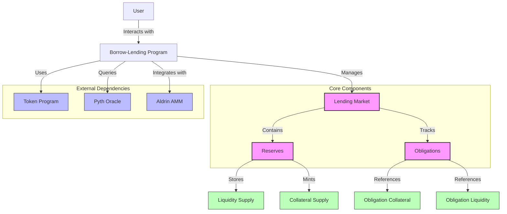

The architecture consists of the following key elements:

1. **Borrow-Lending Program (BLp)**: The main Solana program that implements the lending protocol logic
2. **Lending Market**: The top-level account that defines global parameters and contains references to reserves
3. **Reserves**: Accounts that manage specific asset pools, including their liquidity and collateral
4. **Obligations**: Accounts that track user positions, including deposited collateral and borrowed liquidity
5. **External Dependencies**:
   - **Token Program**: Solana's SPL Token program for token transfers and management
   - **Pyth Oracle**: Provides price feeds for assets
   - **Aldrin AMM**: Used for token swaps and liquidity provision in leveraged yield farming

The platform uses a PDA (Program Derived Address) system to manage authority over various accounts, ensuring that only authorized entities can perform specific actions.

### 2.2 Core Components

The core components of the platform work together to provide the lending and borrowing functionality:

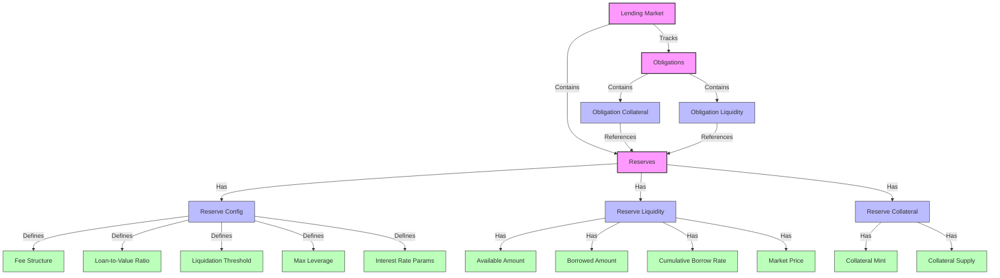

#### 2.2.1 Lending Market

The Lending Market is the top-level account that defines global parameters for the protocol. It includes:

- **Owner**: The authority that can update market parameters
- **Quote Currency**: The universal asset currency (UAC) used for value calculations (typically USD)
- **Pyth Oracle Program**: The address of the oracle program used for price feeds
- **Aldrin AMM**: The address of the AMM program used for swaps and liquidity provision
- **Flash Loan Settings**: Configuration for enabling/disabling flash loans
- **Minimum Collateral Value**: The minimum collateral value required for leveraged positions

#### 2.2.2 Reserves

Reserves are accounts that manage specific asset pools. Each reserve includes:

- **Reserve Liquidity**: Manages the liquidity side of the reserve
  - **Available Amount**: The amount of liquidity available for borrowing
  - **Borrowed Amount**: The amount of liquidity currently borrowed
  - **Cumulative Borrow Rate**: The accumulated interest rate used for interest calculations
  - **Market Price**: The current price of the asset in the quote currency
  - **Mint**: The token mint address
  - **Supply**: The token account holding the liquidity
  - **Fee Receiver**: The account that receives fees

- **Reserve Collateral**: Manages the collateral side of the reserve
  - **Mint**: The collateral token mint address
  - **Supply**: The token account holding the collateral tokens

- **Reserve Config**: Defines the risk parameters for the reserve
  - **Optimal Utilization Rate**: The target utilization rate for optimal interest rates
  - **Loan-to-Value Ratio**: The maximum borrow amount relative to collateral value
  - **Liquidation Threshold**: The point at which a position becomes eligible for liquidation
  - **Liquidation Bonus**: The incentive for liquidators
  - **Interest Rate Parameters**: Min, optimal, and max borrow rates
  - **Fee Structure**: Borrow fees, flash loan fees, and host fees
  - **Max Leverage**: The maximum leverage allowed for yield farming

#### 2.2.3 Obligations

Obligations are accounts that track user positions, including:

- **Owner**: The user who owns the obligation
- **Lending Market**: The lending market the obligation belongs to
- **Reserves**: An array of obligation reserves, which can be either:
  - **Obligation Collateral**: Tracks deposited collateral
    - **Deposit Reserve**: The reserve the collateral was deposited to
    - **Deposited Amount**: The amount of collateral tokens deposited
    - **Market Value**: The value of the collateral in the quote currency
  - **Obligation Liquidity**: Tracks borrowed liquidity
    - **Borrow Reserve**: The reserve the liquidity was borrowed from
    - **Borrowed Amount**: The amount of liquidity tokens borrowed
    - **Market Value**: The value of the borrowed liquidity in the quote currency
    - **Cumulative Borrow Rate Snapshot**: The cumulative borrow rate at the time of borrowing
    - **Loan Kind**: The type of loan (standard or yield farming)

- **Value Calculations**:
  - **Deposited Value**: The total value of deposited collateral
  - **Borrowed Value**: The total value of borrowed liquidity
  - **Allowed Borrow Value**: The maximum value that can be borrowed based on collateral
  - **Unhealthy Borrow Value**: The threshold at which the obligation becomes unhealthy

### 2.3 Data Models

The platform uses a structured data model to represent the various components and their relationships:

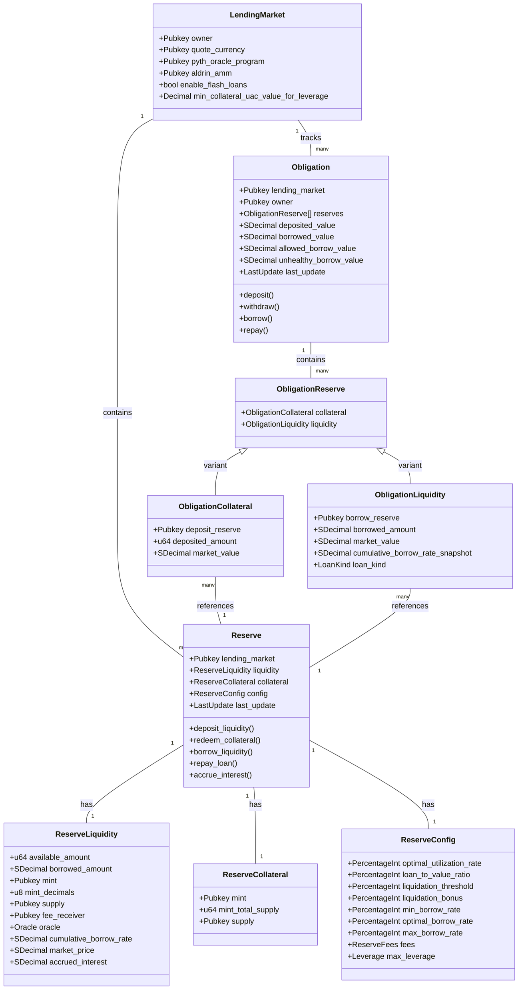

The data model is implemented using Anchor, a framework for Solana program development that provides a more ergonomic experience for developers. The model uses various Rust types and traits to ensure type safety and proper serialization/deserialization.

Key data types include:

- **Decimal**: A fixed-point decimal type used for financial calculations
- **SDecimal**: A signed decimal type for calculations that may result in negative values
- **PercentageInt**: A type representing percentages as integers (0-100)
- **Leverage**: A type representing leverage as a percentage (e.g., 300% for 3x leverage)
- **LoanKind**: An enum representing different types of loans (Standard or YieldFarming)
- **LastUpdate**: A struct tracking when an account was last updated

## 3. Key Processes

### 3.1 Lending and Borrowing

The core functionality of the platform revolves around lending and borrowing operations:

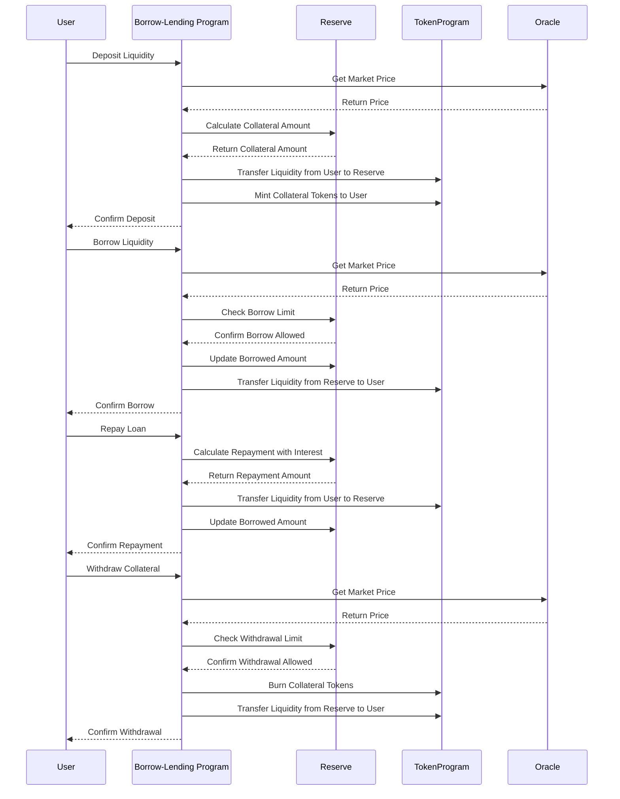

#### 3.1.1 Deposit Liquidity

The deposit process allows users to provide liquidity to the platform and receive collateral tokens in return:

1. User initiates a deposit by calling the `deposit_reserve_liquidity` endpoint
2. The program fetches the current market price from the oracle
3. The reserve calculates the amount of collateral tokens to mint based on the exchange rate
4. The program transfers the liquidity tokens from the user to the reserve's liquidity supply
5. The program mints collateral tokens to the user's wallet
6. The reserve updates its state to reflect the new deposit

The exchange rate between liquidity and collateral tokens is determined by the ratio of total collateral supply to total liquidity supply:

```
R_x = C_s / L_s
```

Where:
- `R_x` is the exchange rate
- `C_s` is the total minted collateral supply
- `L_s` is the total deposited liquidity supply

#### 3.1.2 Borrow Liquidity

The borrow process allows users to borrow liquidity against their deposited collateral:

1. User initiates a borrow by calling the `borrow_obligation_liquidity` endpoint
2. The program fetches current market prices from the oracle
3. The program calculates the user's borrow limit based on their collateral value and the reserve's loan-to-value ratio
4. If the requested borrow amount is within the limit, the program:
   - Updates the obligation to record the new borrow
   - Updates the reserve to record the borrowed amount
   - Transfers the liquidity tokens from the reserve to the user
5. The program applies any borrow fees, which are added to the borrowed amount

The maximum amount a user can borrow is determined by their collateral value and the loan-to-value ratio:

```
V_maxb = V_d * LTV
```

Where:
- `V_maxb` is the maximum borrowable value
- `V_d` is the deposited collateral value
- `LTV` is the loan-to-value ratio

#### 3.1.3 Repay Loan

The repay process allows users to repay their borrowed liquidity:

1. User initiates a repayment by calling the `repay_obligation_liquidity` endpoint
2. The program calculates the repayment amount, including accrued interest
3. The program transfers the liquidity tokens from the user to the reserve
4. The program updates the obligation to reflect the repayment
5. The program updates the reserve to reflect the repaid amount

Interest accrues continuously based on the borrow rate and is calculated using the compound interest formula:

```
L'_o = (R'_c / R_c) * L_o
```

Where:
- `L'_o` is the new borrowed amount
- `R'_c` is the latest cumulative borrow rate
- `R_c` is the cumulative borrow rate at the time of the last interest accrual
- `L_o` is the borrowed amount

#### 3.1.4 Withdraw Collateral

The withdraw process allows users to redeem their collateral tokens for the underlying liquidity:

1. User initiates a withdrawal by calling the `withdraw_obligation_collateral` endpoint
2. The program fetches current market prices from the oracle
3. The program calculates the maximum withdrawable amount based on the user's borrowed value and collateral value
4. If the requested withdrawal is within the limit, the program:
   - Burns the collateral tokens
   - Transfers the liquidity tokens from the reserve to the user
   - Updates the obligation to reflect the withdrawal
   - Updates the reserve to reflect the withdrawn amount

The maximum withdrawable value is calculated as:

```
V_maxw = V_d - (V_b / V_maxb) * V_d
```

Where:
- `V_maxw` is the maximum withdrawable value
- `V_d` is the deposited collateral value
- `V_b` is the borrowed value
- `V_maxb` is the maximum borrowable value

### 3.2 Liquidation

The liquidation process is a critical component of the platform's risk management system:

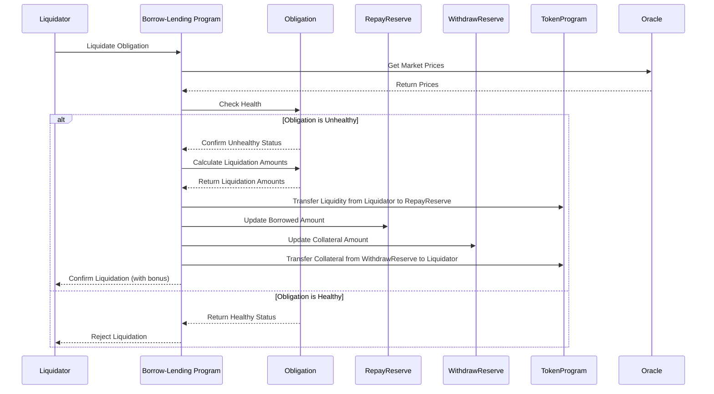

#### 3.2.1 Liquidation Triggers

An obligation becomes eligible for liquidation when its health factor falls below 1, which occurs when:

```
V_b > V_u
```

Where:
- `V_b` is the borrowed value
- `V_u` is the unhealthy borrow value, calculated as the sum of each collateral value multiplied by its liquidation threshold

The unhealthy borrow value is calculated as:

```
V_u = ∑ C^r_b * ε^r
```

Where:
- `C^r_b` is the collateral value for reserve r
- `ε^r` is the liquidation threshold for reserve r

#### 3.2.2 Liquidation Process

The liquidation process allows any user (liquidator) to repay a portion of an unhealthy obligation's debt in exchange for a portion of its collateral, plus a bonus:

1. Liquidator initiates a liquidation by calling the `liquidate_obligation` endpoint
2. The program fetches current market prices from the oracle
3. The program checks if the obligation is unhealthy
4. If unhealthy, the program calculates the liquidation amounts:
   - The maximum liquidation amount (limited by the close factor)
   - The amount of collateral to seize, including the liquidation bonus
5. The program transfers liquidity tokens from the liquidator to the repay reserve
6. The program transfers collateral tokens from the withdraw reserve to the liquidator
7. The program updates the obligation and reserves to reflect the liquidation

#### 3.2.3 Liquidation Incentives

To incentivize liquidators, they receive a bonus when liquidating unhealthy positions. This bonus is configurable per reserve and is typically set between 5-10%.

The liquidation bonus effectively allows liquidators to purchase collateral at a discount:

```
Discount = Liquidation Bonus / (1 + Liquidation Bonus)
```

For example, with a 5% liquidation bonus, liquidators effectively get a 4.76% discount on the collateral.

#### 3.2.4 Maximum Liquidation Amount

To prevent excessive liquidations, the protocol limits the amount that can be liquidated in a single transaction:

```
L_maxl = (min{V_b * κ, L_v} / L_v) * L_b
```

Where:
- `L_maxl` is the maximum liquidity amount to liquidate
- `V_b` is the UAC value of borrowed liquidity
- `κ` is the constant liquidity close factor (50%)
- `L_v` is the UAC value of borrowed liquidity
- `L_b` is the total borrowed liquidity

This ensures that at most 50% of a borrower's debt can be liquidated in a single transaction, giving them an opportunity to add collateral or repay debt before further liquidations.

### 3.3 Flash Loans

Flash loans are uncollateralized loans that must be repaid within the same transaction:

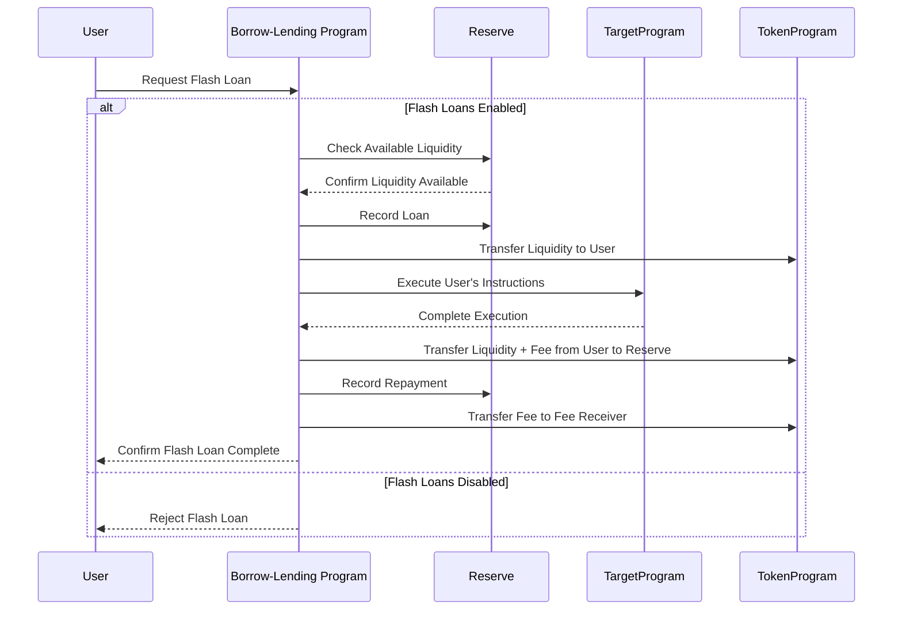

#### 3.3.1 Flash Loan Mechanism

The flash loan process works as follows:

1. User initiates a flash loan by calling the `flash_loan` endpoint, specifying:
   - The amount to borrow
   - The target program to execute
   - The data to pass to the target program
2. The program checks if flash loans are enabled for the lending market
3. The program records the loan in the reserve
4. The program transfers the borrowed liquidity to the user's wallet
5. The program calls the target program with the user's data
6. After the target program executes, the program checks that the borrowed amount plus fees has been returned to the reserve
7. The program records the repayment and transfers the fee to the fee receiver

#### 3.3.2 Flash Loan Fees

Flash loans incur a fee, which is configurable per reserve. The fee is typically set between 0.1% and 0.3% of the borrowed amount.

The fee is calculated as:

```
Fee = Flash Loan Amount * Flash Loan Fee Rate
```

A portion of this fee may go to a host account if provided in the transaction.

#### 3.3.3 Flash Loan Security Measures

To prevent potential exploits, the flash loan implementation includes several security measures:

1. **Reentrancy Protection**: The target program cannot be the lending program itself, preventing direct reentrancy attacks
2. **Balance Verification**: The program verifies that the borrowed amount plus fees are returned to the reserve
3. **Disabled by Default**: Flash loans are disabled by default and must be explicitly enabled by the lending market owner
4. **Fee Enforcement**: The program enforces that the fee is paid, even if the borrowed amount is returned

### 3.4 Leveraged Yield Farming

The platform integrates with Aldrin AMM to enable leveraged yield farming:

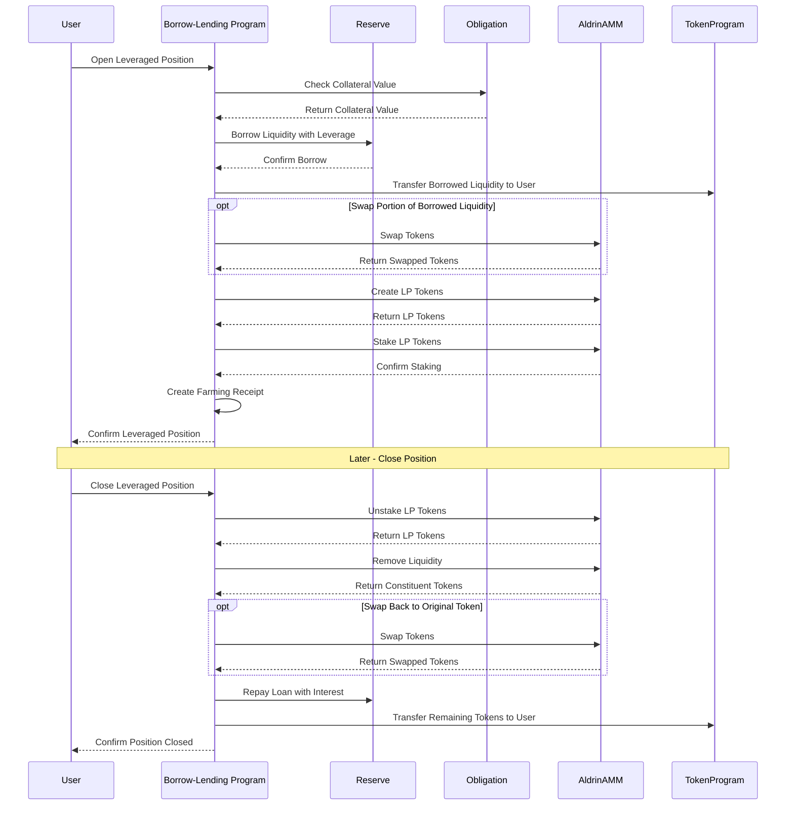

#### 3.4.1 Leverage Mechanism

Leveraged yield farming allows users to borrow additional funds to increase their exposure to a liquidity pool. The leverage is expressed as a percentage, where 100% represents 1x leverage (no borrowing), 200% represents 2x leverage, and so on.

The maximum leverage is configurable per reserve and is calculated based on the loan-to-value ratio:

```
φ_max = (1 - V_maxb^30) / (1 - V_maxb)
```

Where:
- `φ_max` is the maximum leverage
- `V_maxb` is the maximum borrowable UAC value (LTV)

#### 3.4.2 Position Opening

The process of opening a leveraged position involves:

1. User initiates a leveraged position by calling the `open_leveraged_position_on_aldrin` endpoint, specifying:
   - The amount of liquidity to borrow
   - The amount to swap (if any)
   - The minimum swap return
   - The leverage factor
   - The amount of LP tokens to stake
2. The program checks that the user has sufficient collateral and that the requested leverage is within limits
3. The program borrows the specified amount of liquidity with leverage
4. If requested, the program swaps a portion of the borrowed liquidity for the other constituent token
5. The program creates LP tokens by depositing both constituent tokens into the Aldrin pool
6. The program stakes the LP tokens in the Aldrin farming program
7. The program creates a farming receipt to track the position

To ensure that borrowed funds are used for yield farming and not extracted by the user, the program verifies that the user does not end up with more tokens in their wallets than they started with.

#### 3.4.3 Position Closing

The process of closing a leveraged position involves:

1. User initiates closing a position by calling the `close_leveraged_position_on_aldrin` endpoint
2. The program unstakes the LP tokens from the Aldrin farming program
3. The program removes liquidity from the Aldrin pool, receiving the constituent tokens
4. If necessary, the program swaps one constituent token for the other to match the original borrowed token
5. The program repays the borrowed amount plus interest to the reserve
6. The program transfers any remaining tokens (profit) to the user
7. The program closes the farming receipt

## 4. Tokenomics

### 4.1 Interest Rate Model

The platform uses a dynamic interest rate model that adjusts based on the utilization rate of each reserve:

```mermaid
graph LR
    subgraph "Interest Rate Model"
        direction TB
        
        U[Utilization Rate] --> |"R_u < R*_u"| L[Low Utilization Formula]
        U --> |"R_u >= R*_u"| H[High Utilization Formula]
        
        L --> BR[Borrow Rate]
        H --> BR
        
        BR --> |"R_d = R_u * R_b"| DR[Deposit Rate]
    end
    
    subgraph "Interest Rate Curve"
        direction TB
        
        style IRGraph fill:#f9f9f9,stroke:#333,stroke-width:1px
        
        IRGraph[
        "
        ^
        |                                   /
        |                                  /
        |                                 /
        |                                /
        |                               /
        |                              /
        |                             /
        |                            /
        |                           /
        |                          /
        |                         /
        |                        /
        |                       /
        |                      /
        |                     /
        |                    /
        |                   /
        |                  /
        |                 /
        |                /
        |               /
        |              /
        |             /
        |            /
        |           /
        |          /
        |         /
        |        /
        |       /
        |      /
        |     /
        |    /
        |   /
        |  /
        | /
        |/
        +---------------------------------->
          0%       R*_u       100%
          
          R_minb = Min Borrow Rate
          R*_b = Optimal Borrow Rate
          R_maxb = Max Borrow Rate
          R*_u = Optimal Utilization Rate
        "
        ]
    end
```

#### 4.1.1 Utilization Rate Calculation

The utilization rate is the ratio of borrowed liquidity to total liquidity in a reserve:

```
R_u = L_b / L_s
```

Where:
- `R_u` is the utilization rate
- `L_b` is the total borrowed liquidity
- `L_s` is the total deposited liquidity supply

#### 4.1.2 Borrow Rate Calculation

The borrow rate follows a two-slope model:

```
R_b = (R_u / R*_u) * (R*_b - R_minb) + R_minb,                if R_u < R*_u
R_b = ((R_u - R*_u) / (1 - R*_u)) * (R_maxb - R*_b) + R*_b,   otherwise
```

Where:
- `R_b` is the borrow rate/APY
- `R*_u` is the optimal utilization rate (configurable)
- `R*_b` is the optimal borrow rate (configurable)
- `R_minb` is the minimum borrow rate (configurable)
- `R_maxb` is the maximum borrow rate (configurable)

This model creates two distinct slopes:
- Below optimal utilization: Interest rates increase slowly to encourage borrowing
- Above optimal utilization: Interest rates increase sharply to discourage borrowing and encourage deposits

#### 4.1.3 Supply Rate Calculation

The supply rate is derived from the borrow rate by scaling it by the utilization rate:

```
R_d = R_u * R_b
```

Where:
- `R_d` is the deposit rate/APY
- `R_u` is the utilization rate
- `R_b` is the borrow rate/APY

This ensures that the interest paid by borrowers is distributed to suppliers in proportion to the utilization of the reserve.

#### 4.1.4 Compound Interest

Interest accrues continuously based on the borrow rate and is calculated using the compound interest formula:

```
R_i = (1 + R_b/S_a)^S_e
```

Where:
- `R_i` is the compound interest rate
- `R_b` is the borrow rate
- `S_a` is the number of slots in a calendar year
- `S_e` is the elapsed slots

The reserve's liquidity supply is updated with interest:

```
L'_s = L_s * R_i
```

Where:
- `L'_s` is the new liquidity supply
- `L_s` is the old liquidity supply
- `R_i` is the compound interest rate

### 4.2 Fee Structure

The platform implements several types of fees:

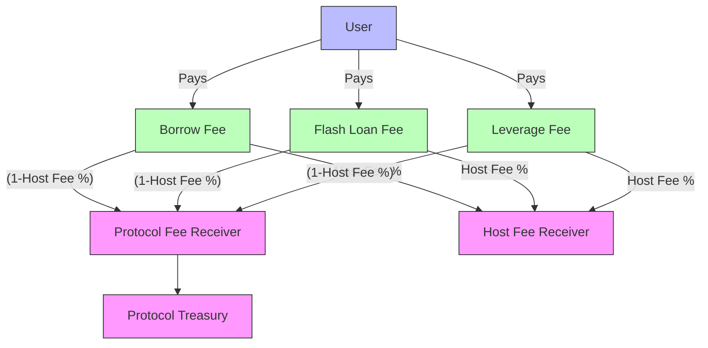

#### 4.2.1 Borrow Fee

A percentage fee charged when borrowing assets, expressed as a Wad (10^18 = 1). For example:
- 1% = 10_000_000_000_000_000
- 0.01% (1 basis point) = 100_000_000_000_000

The borrow fee is added to the borrowed amount and must be repaid along with the principal.

#### 4.2.2 Leverage Fee

Similar to the borrow fee but applies specifically to leverage yield farming operations. This fee may be set differently from the standard borrow fee to account for the different risk profile of leveraged positions.

#### 4.2.3 Flash Loan Fee

Fee for flash loans, expressed as a Wad. For example:
- 0.3% (Aave flash loan fee) = 3_000_000_000_000_000

This fee must be paid when the flash loan is repaid within the same transaction.

#### 4.2.4 Host Fee

Amount of fee going to host account, if provided in liquidate and repay operations. This allows third-party integrators to earn a portion of the fees generated by their users.

The host fee is expressed as a percentage (0-100) of the total fee.

### 4.3 Collateralization

The platform uses a collateralization system to ensure loans are backed by sufficient assets:

```mermaid
graph TD
    subgraph "Collateralization Parameters"
        LTV[Loan-to-Value Ratio]
        LT[Liquidation Threshold]
        LB[Liquidation Bonus]
    end
    
    subgraph "Collateralization States"
        direction TB
        
        style CollateralGraph fill:#f9f9f9,stroke:#333,stroke-width:1px
        
        CollateralGraph[
        "
        Collateral Value
        ^
        |
        |                   Safe Zone
        |                   (Can borrow more)
        |                   
        |------------------+
        |                  |
        |                  | Warning Zone
        |                  | (Cannot borrow more)
        |                  |
        |------------------+
        |                  |
        |                  | Liquidation Zone
        |                  | (Can be liquidated)
        |                  |
        +------------------+---------------->
                           Borrowed Value
                           
        LTV = Maximum borrow amount relative to collateral
        LT = Threshold where liquidation becomes possible
        LB = Bonus liquidators receive (incentive)
        "
        ]
    end
    
    LTV --> CollateralGraph
    LT --> CollateralGraph
    LB --> CollateralGraph
```

#### 4.3.1 Loan-to-Value Ratios

Each reserve has a configurable loan-to-value ratio that determines how much can be borrowed against collateral. For example, if SOL has an LTV of 85%, a user depositing $100 worth of SOL can borrow up to $85 worth of assets.

The LTV is expressed as a percentage (0-100) and is used to calculate the maximum borrow value:

```
V_maxb = V_d * LTV / 100
```

Where:
- `V_maxb` is the maximum borrowable value
- `V_d` is the deposited collateral value
- `LTV` is the loan-to-value ratio

#### 4.3.2 Liquidation Thresholds

Each reserve also has a liquidation threshold that determines when a position becomes unhealthy and eligible for liquidation. This threshold is always higher than the LTV ratio.

The liquidation threshold is expressed as a percentage (0-100) and is used to calculate the unhealthy borrow value:

```
V_u = V_d * LT / 100
```

Where:
- `V_u` is the unhealthy borrow value
- `V_d` is the deposited collateral value
- `LT` is the liquidation threshold

When the borrowed value exceeds the unhealthy borrow value, the position becomes eligible for liquidation.

#### 4.3.3 Maximum Leverage

For leveraged yield farming, each reserve has a configurable maximum leverage parameter that limits the amount of leverage users can take.

The maximum leverage is calculated based on the loan-to-value ratio:

```
φ_max = (1 - V_maxb^30) / (1 - V_maxb)
```

Where:
- `φ_max` is the maximum leverage
- `V_maxb` is the maximum borrowable UAC value (LTV / 100)

This formula ensures that the maximum leverage is consistent with the risk parameters of the reserve.

### 4.4 Emissions System

The platform includes an emissions (rewards) system for both lenders and borrowers:

```mermaid
flowchart TD
    ER[Emission Rate] --> |"ω^b (Borrower Rate)"| BE[Borrower Emissions]
    ER --> |"ω^s (Supplier Rate)"| SE[Supplier Emissions]
    
    BE --> |"Based on Share of Borrowed Amount"| BU[Borrower Users]
    SE --> |"Based on Share of Supplied Amount"| SU[Supplier Users]
    
    subgraph "Emission Formula"
        direction TB
        
        style EmissionFormula fill:#f9f9f9,stroke:#333,stroke-width:1px
        
        EmissionFormula[
        "
        For Borrowers:
        E = ω^b * S_e * (L^u_b / L^r_b)
        
        For Suppliers:
        E = ω^s * S_e * (L^u_s / L^r_s)
        
        Where:
        E = Emission tokens a user can claim
        ω = Emitted tokens per slot
        S_e = Elapsed slots
        L^u_b = User's borrowed amount
        L^r_b = Reserve's total borrowed amount
        L^u_s = User's supplied amount
        L^r_s = Reserve's total supplied amount
        "
        ]
    end
    
    BE --> EmissionFormula
    SE --> EmissionFormula
    
    classDef rate fill:#bbf,stroke:#333,stroke-width:1px;
    classDef emission fill:#bfb,stroke:#333,stroke-width:1px;
    classDef user fill:#f9f,stroke:#333,stroke-width:1px;
    
    class ER rate;
    class BE,SE emission;
    class BU,SU user;
```

#### 4.4.1 Emission Distribution

Emissions are distributed between users based on their share in a particular reserve's pool. The distribution formulas differ for borrowers and lenders:

For borrowers:
```
E = ω^b * S_e * (L^u_b / L^r_b)
```

For lenders:
```
E = ω^s * S_e * (L^u_s / L^r_s)
```

Where:
- `E` is the emission tokens a user can claim
- `ω` is the emitted tokens per slot
- `S_e` is the elapsed slots
- `L^u_b` is the user's borrowed amount
- `L^r_b` is the reserve's total borrowed amount
- `L^u_s` is the user's supplied amount
- `L^r_s` is the reserve's total supplied amount

#### 4.4.2 Reward Calculation

The emissions system tracks the accumulated rewards for each user based on their participation in the protocol. Users can claim these rewards at any time.

The reward calculation takes into account:
- The emission rate for the reserve
- The user's share of the reserve (borrowed or supplied)
- The time elapsed since the last reward calculation

This creates an incentive for users to participate in the protocol and helps bootstrap liquidity in the early stages.

## 5. Security Considerations

### 5.1 Identified Vulnerabilities

Based on a thorough analysis of the codebase, several potential vulnerabilities have been identified:

```mermaid
flowchart TD
    subgraph "Security Checkpoints"
        OS[Oracle Security]
        FS[Flash Loan Security]
        LS[Leverage Security]
        LQS[Liquidation Security]
        MS[Mathematical Security]
        AS[Access Control Security]
    end
    
    OS --> |"Check"| OSC1[Oracle Freshness]
    OS --> |"Check"| OSC2[Price Manipulation]
    OS --> |"Check"| OSC3[Oracle Dependency]
    
    FS --> |"Check"| FSC1[Reentrancy Protection]
    FS --> |"Check"| FSC2[Fee Calculation]
    FS --> |"Check"| FSC3[Repayment Verification]
    
    LS --> |"Check"| LSC1[Leverage Limits]
    LS --> |"Check"| LSC2[Token Leakage]
    LS --> |"Check"| LSC3[Position Ownership]
    
    LQS --> |"Check"| LQSC1[Liquidation Thresholds]
    LQS --> |"Check"| LQSC2[Liquidation Calculation]
    LQS --> |"Check"| LQSC3[Liquidation Incentives]
    
    MS --> |"Check"| MSC1[Decimal Precision]
    MS --> |"Check"| MSC2[Overflow/Underflow]
    MS --> |"Check"| MSC3[Rounding Errors]
    
    AS --> |"Check"| ASC1[Account Validation]
    AS --> |"Check"| ASC2[PDA Seed Construction]
    AS --> |"Check"| ASC3[Authority Verification]
    
    classDef category fill:#f9f,stroke:#333,stroke-width:2px;
    classDef check fill:#bbf,stroke:#333,stroke-width:1px;
    
    class OS,FS,LS,LQS,MS,AS category;
    class OSC1,OSC2,OSC3,FSC1,FSC2,FSC3,LSC1,LSC2,LSC3,LQSC1,LQSC2,LQSC3,MSC1,MSC2,MSC3,ASC1,ASC2,ASC3 check;
```

#### 5.1.1 Oracle-Related Vulnerabilities

**Oracle Staleness**

The code checks for oracle staleness, but there's a risk if the `ORACLE_STALE_AFTER_SLOTS_ELAPSED` constant is set too high. This could allow operations to proceed with outdated price data during high market volatility.

**Oracle Dependency Risk**

The platform has a critical dependency on the oracle provider. If the oracle service is disrupted, the entire platform becomes non-functional until a protocol upgrade allows changing the oracle settings.

#### 5.1.2 Flash Loan Vulnerabilities

**Flash Loan Reentrancy**

While the code prevents direct reentrancy by checking that the target program is not the lending program itself, it doesn't protect against cross-program reentrancy attacks where the target program calls another program that then calls back into the lending program.

**Flash Loan Fee Calculation**

If the fee calculation has precision issues or rounding errors, it might be possible to execute flash loans with slightly lower fees than intended.

#### 5.1.3 Leveraged Position Vulnerabilities

**Leverage Limit Bypass**

While the code checks that the requested leverage doesn't exceed the maximum allowed leverage, a user could potentially open multiple leveraged positions across different reserves to achieve effective leverage higher than the per-reserve limit.

**Token Leakage in Leveraged Positions**

The code correctly checks that users don't end up with more tokens than they started with, but there's a potential edge case if the user can manipulate their wallet balances during the transaction through other means.

#### 5.1.4 Liquidation Vulnerabilities

**Liquidation Threshold Manipulation**

The code ensures that the liquidation threshold is greater than the loan-to-value ratio, but if these values are set too close together, it could create a situation where normal market volatility triggers unnecessary liquidations.

**Liquidation Calculation Precision**

The liquidation amount calculations involve multiple mathematical operations that could introduce rounding errors or precision loss, potentially allowing liquidators to extract slightly more value than intended.

#### 5.1.5 Mathematical and Precision Issues

**Decimal Precision Loss**

The codebase uses a custom `Decimal` type for financial calculations, but some operations might introduce precision loss, especially when dealing with very large or very small numbers.

**Integer Overflow/Underflow**

While the code generally uses checked arithmetic operations (`checked_add`, `checked_sub`, etc.), there might be edge cases where these checks are missed or where intermediate calculations could overflow before the check is applied.

#### 5.1.6 Access Control and Authorization

**Account Validation Reliance**

The code relies on the token program for certain validations, but if there are edge cases where these validations are insufficient, it could lead to security issues.

**PDA Seed Construction**

While the PDA seed construction is well-thought-out, any errors in the implementation could lead to address collisions or allow users to manipulate the system.

### 5.2 Security Best Practices

To mitigate the identified vulnerabilities, the following security best practices are recommended:

#### 5.2.1 Oracle Usage

- Implement fallback oracle mechanisms or consider a weighted average from multiple oracle providers
- Set appropriate staleness thresholds based on market volatility
- Implement circuit breakers that pause certain operations during extreme market conditions
- Add governance mechanisms to update oracle sources without requiring a program upgrade

#### 5.2.2 Flash Loan Handling

- Enhance reentrancy protection to cover cross-program reentrancy attacks
- Implement a whitelist of allowed target programs for flash loans
- Add additional verification steps for flash loan repayments
- Consider implementing a flash loan pause mechanism that can be activated in case of detected exploits

#### 5.2.3 Leverage Management

- Implement system-wide leverage tracking to prevent users from bypassing per-reserve leverage limits
- Add additional checks for leveraged position creation and closing
- Consider implementing a maximum total leverage per user across all reserves
- Add stress testing mechanisms for leveraged positions

#### 5.2.4 Liquidation Safety

- Ensure sufficient separation between loan-to-value ratios and liquidation thresholds
- Implement gradual liquidation mechanisms to prevent large price impacts
- Add circuit breakers for mass liquidation events
- Consider implementing a liquidation delay for large positions

#### 5.2.5 Mathematical Precision

- Conduct extensive testing of mathematical operations with extreme values
- Add additional checks for precision loss in critical calculations
- Consider using higher precision for intermediate calculations
- Implement bounds checking for all mathematical operations

#### 5.2.6 Access Control

- Regularly audit PDA seed construction and account validation logic
- Implement additional checks for critical operations
- Consider adding a time-lock for certain administrative operations
- Implement a comprehensive permission system for protocol upgrades

## 6. Developer Guide

### 6.1 Environment Setup

#### 6.1.1 Prerequisites

To work with the Solana Borrow-Lending Platform, you'll need:

- Rust (latest stable version)
- Solana CLI (latest version)
- Anchor Framework (latest version)
- Node.js and npm/yarn (for testing)
- Git

#### 6.1.2 Installation

Clone the repository and install dependencies:

```bash
git clone https://github.com/aldrin-labs/solana-borrow-lending.git
cd solana-borrow-lending
yarn install
```

#### 6.1.3 Configuration

The platform can be configured through various parameters in the codebase:

- Interest rate parameters in `reserve.rs`
- Liquidation parameters in `reserve.rs`
- Fee structures in `reserve.rs`
- Oracle configuration in `pyth.rs`
- Flash loan settings in `lending_market.rs`

### 6.2 Program Structure

The program follows a modular structure:

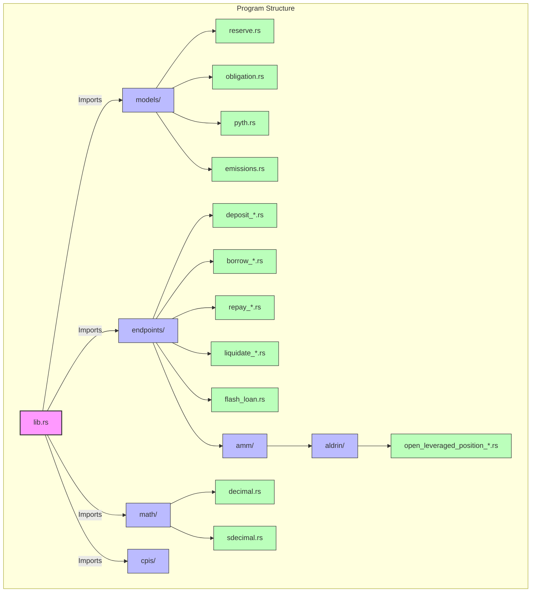

#### 6.2.1 Directory Organization

- **src/**: Contains the main program code
  - **lib.rs**: Entry point for the program
  - **models/**: Data structures and business logic
  - **endpoints/**: Instruction handlers
  - **math/**: Mathematical utilities
  - **cpis/**: Cross-program invocation utilities
- **tests/**: Contains test files
- **programs/**: Contains the Solana programs
  - **borrow-lending/**: The main lending program
  - **stable-coin/**: A related stable coin program
- **cli/**: Command-line interface for interacting with the program

#### 6.2.2 Module Relationships

The program is organized into several key modules:

- **models**: Contains the core data structures and business logic
  - **reserve.rs**: Manages reserve state and operations
  - **obligation.rs**: Manages obligation state and operations
  - **pyth.rs**: Handles oracle integration
  - **emissions.rs**: Manages reward emissions

- **endpoints**: Contains the instruction handlers
  - **deposit_reserve_liquidity.rs**: Handles deposit operations
  - **borrow_obligation_liquidity.rs**: Handles borrow operations
  - **repay_obligation_liquidity.rs**: Handles repay operations
  - **liquidate_obligation.rs**: Handles liquidation operations
  - **flash_loan.rs**: Handles flash loan operations
  - **amm/aldrin/**: Handles leveraged yield farming operations

- **math**: Contains mathematical utilities
  - **decimal.rs**: Implements the Decimal type for financial calculations
  - **sdecimal.rs**: Implements the SDecimal type for signed calculations

### 6.3 Key Interfaces

#### 6.3.1 Public Endpoints

The program exposes several public endpoints:

- **init_lending_market**: Initializes a new lending market
- **set_lending_market_owner**: Sets the owner of a lending market
- **init_reserve**: Initializes a new reserve
- **refresh_reserve**: Updates a reserve with the latest oracle prices
- **deposit_reserve_liquidity**: Deposits liquidity into a reserve
- **redeem_reserve_collateral**: Redeems collateral for liquidity
- **init_obligation**: Initializes a new obligation
- **refresh_obligation**: Updates an obligation with the latest prices
- **deposit_obligation_collateral**: Deposits collateral into an obligation
- **withdraw_obligation_collateral**: Withdraws collateral from an obligation
- **borrow_obligation_liquidity**: Borrows liquidity against an obligation
- **repay_obligation_liquidity**: Repays borrowed liquidity
- **liquidate_obligation**: Liquidates an unhealthy obligation
- **flash_loan**: Executes a flash loan
- **open_leveraged_position_on_aldrin**: Opens a leveraged yield farming position
- **close_leveraged_position_on_aldrin**: Closes a leveraged yield farming position

#### 6.3.2 Account Structures

The program uses several account structures:

- **LendingMarket**: The top-level account for the lending market
- **Reserve**: Manages a specific asset pool
- **Obligation**: Tracks a user's positions
- **AldrinFarmingReceipt**: Tracks a leveraged yield farming position

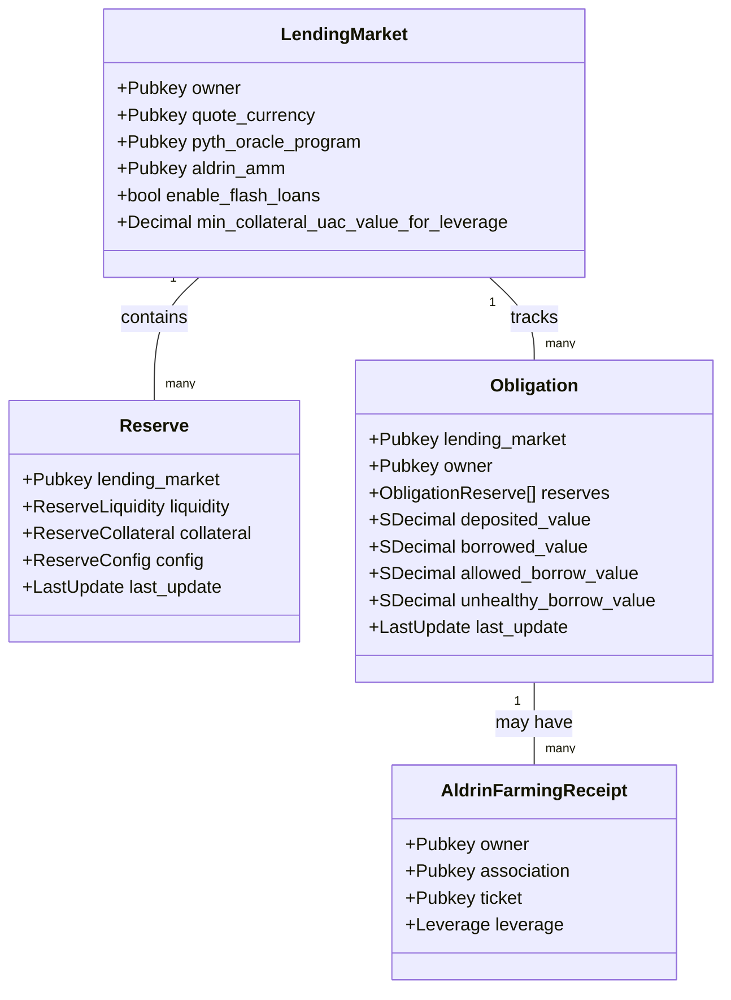

### 6.4 Testing

#### 6.4.1 Test Coverage

The program includes extensive tests covering:

- Unit tests for individual components
- Integration tests for end-to-end flows
- Stress tests for extreme scenarios

#### 6.4.2 Test Scenarios

Key test scenarios include:

- Deposit and withdrawal flows
- Borrow and repayment flows
- Interest accrual
- Liquidation scenarios
- Flash loan operations
- Leveraged yield farming operations

#### 6.4.3 Running Tests

To run the tests:

```bash
./bin/test.sh
```

For code coverage:

```bash
./bin/codecov.sh
```

## 7. Mathematical Models

### 7.1 Interest Calculation

The platform uses a compound interest model for calculating interest:

```mermaid
flowchart TD
    BR[Borrow Rate Calculation] --> |"Input"| CI[Compound Interest Calculation]
    SE[Slots Elapsed] --> |"Input"| CI
    
    CI --> |"Updates"| BA[Borrowed Amount]
    CI --> |"Updates"| CBR[Cumulative Borrow Rate]
    
    subgraph "Compound Interest Formula"
        direction TB
        
        style Formula fill:#f9f9f9,stroke:#333,stroke-width:1px
        
        Formula[
        "
        R_i = (1 + R_b/S_a)^S_e
        
        Where:
        R_i = Compound interest rate
        R_b = Borrow rate
        S_a = Slots per year
        S_e = Elapsed slots
        
        New borrowed amount:
        L'_s = L_s * R_i
        
        New obligation borrowed amount:
        L'_o = (R'_c/R_c) * L_o
        
        Where:
        R'_c = New cumulative borrow rate
        R_c = Old cumulative borrow rate
        L_o = Old borrowed amount
        "
        ]
    end
    
    CI --> Formula
    
    classDef input fill:#bbf,stroke:#333,stroke-width:1px;
    classDef calculation fill:#f9f,stroke:#333,stroke-width:2px;
    classDef output fill:#bfb,stroke:#333,stroke-width:1px;
    
    class BR,SE input;
    class CI calculation;
    class BA,CBR output;
```

#### 7.1.1 Compound Interest Formula

The compound interest formula used is:

```
R_i = (1 + R_b/S_a)^S_e
```

Where:
- `R_i` is the compound interest rate
- `R_b` is the borrow rate
- `S_a` is the number of slots in a calendar year
- `S_e` is the elapsed slots

#### 7.1.2 Interest Accrual

Interest accrues on the borrowed amount:

```
L'_s = L_s * R_i
```

Where:
- `L'_s` is the new liquidity supply
- `L_s` is the old liquidity supply
- `R_i` is the compound interest rate

For obligations, interest accrues based on the cumulative borrow rate:

```
L'_o = (R'_c/R_c) * L_o
```

Where:
- `L'_o` is the new borrowed amount
- `R'_c` is the new cumulative borrow rate
- `R_c` is the old cumulative borrow rate
- `L_o` is the old borrowed amount

### 7.2 Exchange Rate Calculation

The exchange rate between liquidity and collateral tokens is dynamic:

```mermaid
flowchart TD
    LS[Liquidity Supply] --> |"Input"| ER[Exchange Rate Calculation]
    CS[Collateral Supply] --> |"Input"| ER
    
    ER --> |"Used for"| LC[Liquidity to Collateral Conversion]
    ER --> |"Used for"| CL[Collateral to Liquidity Conversion]
    
    LC --> |"Used in"| Deposit[Deposit Operation]
    CL --> |"Used in"| Withdraw[Withdraw Operation]
    
    subgraph "Exchange Rate Formula"
        direction TB
        
        style Formula fill:#f9f9f9,stroke:#333,stroke-width:1px
        
        Formula[
        "
        R_x = C_s / L_s
        
        Where:
        R_x = Exchange rate
        C_s = Total minted collateral supply
        L_s = Total deposited liquidity supply
        
        Liquidity to Collateral:
        C = L * R_x
        
        Collateral to Liquidity:
        L = C / R_x
        "
        ]
    end
    
    ER --> Formula
    
    classDef input fill:#bbf,stroke:#333,stroke-width:1px;
    classDef calculation fill:#f9f,stroke:#333,stroke-width:2px;
    classDef conversion fill:#bfb,stroke:#333,stroke-width:1px;
    classDef operation fill:#fbb,stroke:#333,stroke-width:1px;
    
    class LS,CS input;
    class ER calculation;
    class LC,CL conversion;
    class Deposit,Withdraw operation;
```

#### 7.2.1 Exchange Rate Formula

The exchange rate is calculated as:

```
R_x = C_s / L_s
```

Where:
- `R_x` is the exchange rate
- `C_s` is the total minted collateral supply
- `L_s` is the total deposited liquidity supply

#### 7.2.2 Liquidity to Collateral Conversion

When depositing liquidity, the amount of collateral to mint is calculated as:

```
C = L * R_x
```

Where:
- `C` is the collateral amount
- `L` is the liquidity amount
- `R_x` is the exchange rate

#### 7.2.3 Collateral to Liquidity Conversion

When withdrawing collateral, the amount of liquidity to return is calculated as:

```
L = C / R_x
```

Where:
- `L` is the liquidity amount
- `C` is the collateral amount
- `R_x` is the exchange rate

### 7.3 Liquidation Calculation

The liquidation process involves several calculations:

```mermaid
flowchart TD
    BV[Borrowed Value] --> |"Input"| LC[Liquidation Calculation]
    CV[Collateral Value] --> |"Input"| LC
    LT[Liquidation Threshold] --> |"Input"| LC
    LB[Liquidation Bonus] --> |"Input"| LC
    
    LC --> |"Output"| MLA[Max Liquidation Amount]
    LC --> |"Output"| SA[Settlement Amount]
    LC --> |"Output"| WA[Withdrawal Amount]
    
    subgraph "Liquidation Formula"
        direction TB
        
        style Formula fill:#f9f9f9,stroke:#333,stroke-width:1px
        
        Formula[
        "
        L_maxl = (min{V_b * κ, L_v} / L_v) * L_b
        
        Where:
        L_maxl = Maximum liquidity amount to liquidate
        V_b = UAC value of borrowed liquidity
        κ = Constant liquidity close factor (50%)
        L_v = UAC value of borrowed liquidity
        L_b = Total borrowed liquidity
        
        Liquidation value with bonus:
        LV = L * (1 + LB)
        
        Where:
        L = Liquidation amount
        LB = Liquidation bonus
        "
        ]
    end
    
    LC --> Formula
    
    classDef input fill:#bbf,stroke:#333,stroke-width:1px;
    classDef calculation fill:#f9f,stroke:#333,stroke-width:2px;
    classDef output fill:#bfb,stroke:#333,stroke-width:1px;
    
    class BV,CV,LT,LB input;
    class LC calculation;
    class MLA,SA,WA output;
```

#### 7.3.1 Maximum Liquidation Amount

The maximum amount that can be liquidated in a single transaction is calculated as:

```
L_maxl = (min{V_b * κ, L_v} / L_v) * L_b
```

Where:
- `L_maxl` is the maximum liquidity amount to liquidate
- `V_b` is the UAC value of borrowed liquidity
- `κ` is the constant liquidity close factor (50%)
- `L_v` is the UAC value of borrowed liquidity
- `L_b` is the total borrowed liquidity

#### 7.3.2 Liquidation Bonus

The liquidation bonus provides an incentive for liquidators by allowing them to purchase collateral at a discount:

```
LV = L * (1 + LB)
```

Where:
- `LV` is the liquidation value
- `L` is the liquidation amount
- `LB` is the liquidation bonus

The effective discount is calculated as:

```
Discount = LB / (1 + LB)
```

### 7.4 Leverage Calculation

The leverage calculation determines the maximum leverage allowed for yield farming:

```mermaid
flowchart TD
    LTV[Loan-to-Value Ratio] --> |"Input"| ML[Max Leverage Calculation]
    
    ML --> |"Limits"| LP[Leveraged Position]
    
    subgraph "Leverage Formula"
        direction TB
        
        style Formula fill:#f9f9f9,stroke:#333,stroke-width:1px
        
        Formula[
        "
        φ_max = (1 - V_maxb^30) / (1 - V_maxb)
        
        Where:
        φ_max = Maximum leverage
        V_maxb = Maximum borrowable UAC value (LTV)
        
        Leveraged borrow value:
        V_l = V_r * φ
        
        Where:
        V_l = Leveraged borrow value
        V_r = Regular borrow value
        φ = Leverage factor
        "
        ]
    end
    
    ML --> Formula
    
    classDef input fill:#bbf,stroke:#333,stroke-width:1px;
    classDef calculation fill:#f9f,stroke:#333,stroke-width:2px;
    classDef output fill:#bfb,stroke:#333,stroke-width:1px;
    
    class LTV input;
    class ML calculation;
    class LP output;
```

#### 7.4.1 Maximum Leverage Formula

The maximum leverage is calculated as:

```
φ_max = (1 - V_maxb^30) / (1 - V_maxb)
```

Where:
- `φ_max` is the maximum leverage
- `V_maxb` is the maximum borrowable UAC value (LTV / 100)

This formula ensures that the maximum leverage is consistent with the risk parameters of the reserve.

#### 7.4.2 Leveraged Borrow Value

The leveraged borrow value is calculated as:

```
V_l = V_r * φ
```

Where:
- `V_l` is the leveraged borrow value
- `V_r` is the regular borrow value
- `φ` is the leverage factor

This allows users to borrow more than would normally be allowed by their collateral, specifically for yield farming purposes.

## 8. Integration Guide

### 8.1 Oracle Integration

The platform integrates with Pyth Network for price feeds:

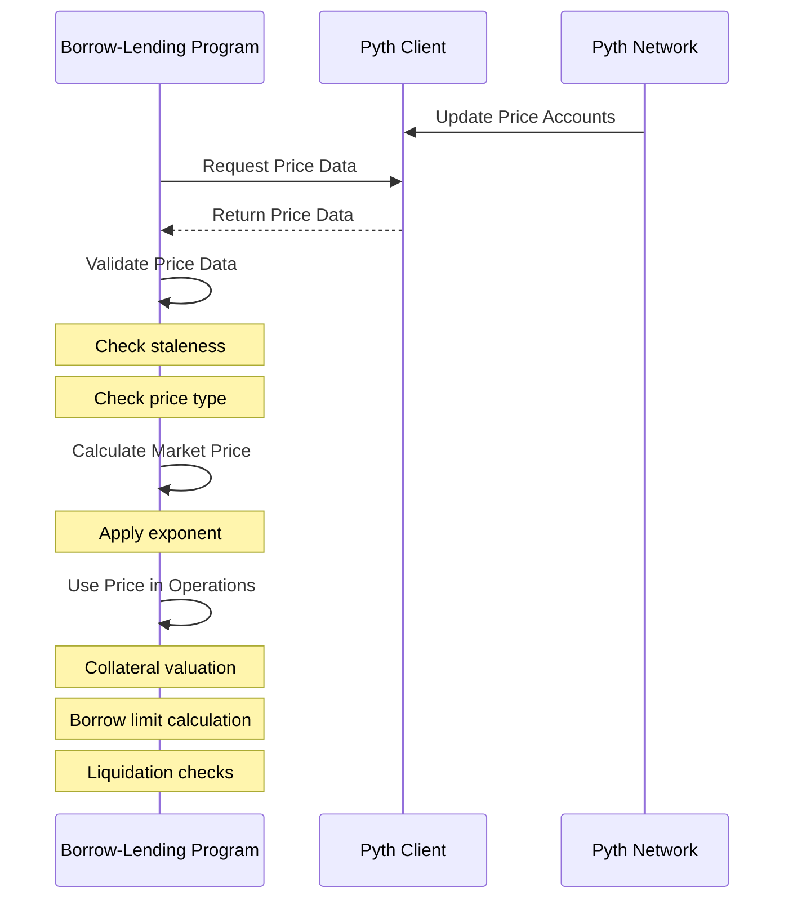

#### 8.1.1 Pyth Network Integration

The platform uses Pyth Network for price feeds, which provides real-time price data for various assets. The integration involves:

1. Specifying the Pyth oracle program ID in the lending market
2. Configuring each reserve with the appropriate price account
3. Fetching and validating price data when needed
4. Converting the price data to the correct format for use in calculations

#### 8.1.2 Price Feed Usage

Price feeds are used for several key operations:

- Calculating the value of collateral
- Determining borrow limits
- Checking if obligations are healthy
- Calculating liquidation amounts

The platform includes safety checks to ensure that price data is fresh and valid before using it in calculations.

### 8.2 AMM Integration

The platform integrates with Aldrin AMM for leveraged yield farming:

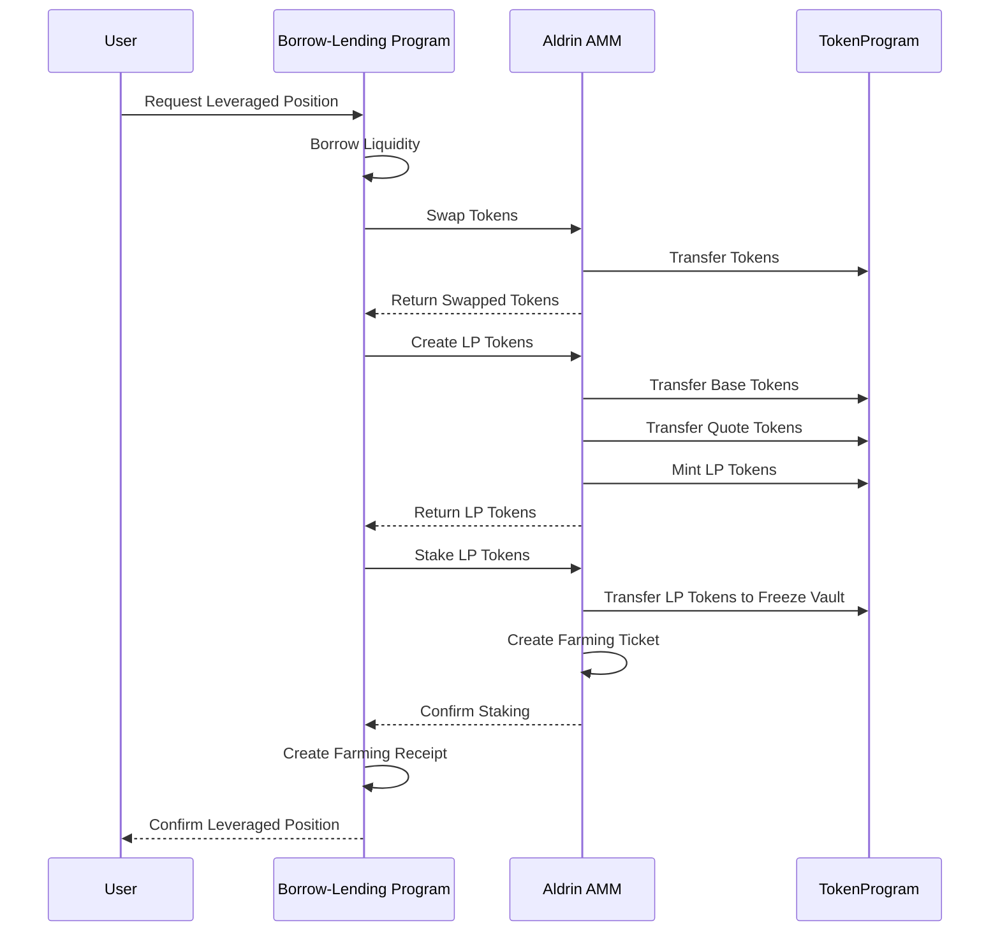

#### 8.2.1 Aldrin AMM Integration

The platform integrates with Aldrin AMM for token swaps and liquidity provision in leveraged yield farming. The integration involves:

1. Specifying the Aldrin AMM program ID in the lending market
2. Using Aldrin's swap functionality to exchange tokens
3. Using Aldrin's liquidity provision functionality to create LP tokens
4. Using Aldrin's farming functionality to stake LP tokens

#### 8.2.2 Swap Mechanism

The swap mechanism allows users to exchange one token for another as part of the leveraged yield farming process. The integration ensures that:

1. The swap is executed at a fair price
2. The minimum swap return is respected
3. The swapped tokens are used for liquidity provision

### 8.3 Token Integration

The platform integrates with Solana's SPL Token program for token operations:

```mermaid
sequenceDiagram
    participant BLp as Borrow-Lending Program
    participant TokenProgram
    participant Mint
    participant SourceWallet
    participant DestinationWallet
    
    %% Transfer
    BLp->>TokenProgram: Transfer Tokens
    TokenProgram->>SourceWallet: Debit Tokens
    TokenProgram->>DestinationWallet: Credit Tokens
    TokenProgram-->>BLp: Confirm Transfer
    
    %% Mint
    BLp->>TokenProgram: Mint Tokens
    TokenProgram->>Mint: Increase Supply
    TokenProgram->>DestinationWallet: Credit Tokens
    TokenProgram-->>BLp: Confirm Mint
    
    %% Burn
    BLp->>TokenProgram: Burn Tokens
    TokenProgram->>SourceWallet: Debit Tokens
    TokenProgram->>Mint: Decrease Supply
    TokenProgram-->>BLp: Confirm Burn
```

#### 8.3.1 SPL Token Integration

The platform uses Solana's SPL Token program for all token operations, including:

1. Transferring tokens between accounts
2. Minting collateral tokens
3. Burning collateral tokens
4. Managing token accounts

#### 8.3.2 Token Account Management

The platform manages several types of token accounts:

- Reserve liquidity supply accounts
- Reserve collateral supply accounts
- User token wallets
- Fee receiver accounts

The platform uses PDAs (Program Derived Addresses) to manage authority over these accounts, ensuring that only authorized entities can perform operations on them.

## 9. Operational Considerations

### 9.1 Performance

#### 9.1.1 Computational Limits

Solana programs are subject to computational limits, which can affect the performance of the platform:

- Instruction data size limit: 1232 bytes
- Transaction size limit: 1232 bytes
- Compute unit limit: 200,000 units per instruction
- Account size limit: 10 MB

The platform is designed to work within these limits, but complex operations like leveraged yield farming may require multiple transactions.

#### 9.1.2 Transaction Costs

Transactions on Solana incur costs in the form of transaction fees and rent for account storage. The platform is designed to minimize these costs by:

- Reusing accounts where possible
- Batching operations where appropriate
- Optimizing account sizes

#### 9.1.3 Optimization Strategies

Several optimization strategies are employed:

- Caching frequently used values
- Minimizing account lookups
- Using efficient data structures
- Batching operations where possible

### 9.2 Governance

#### 9.2.1 Parameter Adjustment

The platform includes several parameters that can be adjusted by governance:

- Interest rate parameters
- Liquidation parameters
- Fee structures
- Oracle configuration
- Flash loan settings

These parameters can be adjusted to respond to changing market conditions or to optimize the platform's performance.

#### 9.2.2 Protocol Upgrades

The platform can be upgraded through a governance process:

```mermaid
flowchart TD
    subgraph "Governance Process"
        direction TB
        
        style GovernanceProcess fill:#f9f9f9,stroke:#333,stroke-width:1px
        
        GovernanceProcess[
        "
        1. Proposal Submission
        2. Community Discussion
        3. Voting Period
        4. Implementation
        5. Monitoring
        "
        ]
    end
```

Upgrades can include:

- Bug fixes
- New features
- Parameter adjustments
- Security enhancements

### 9.3 Risk Management

The platform includes a comprehensive risk management framework:

```mermaid
flowchart TD
    subgraph "Risk Categories"
        MR[Market Risk]
        LR[Liquidity Risk]
        OR[Oracle Risk]
        CR[Credit Risk]
        TR[Technical Risk]
    end
    
    MR --> |"Mitigated by"| MRM[Market Risk Mitigations]
    LR --> |"Mitigated by"| LRM[Liquidity Risk Mitigations]
    OR --> |"Mitigated by"| ORM[Oracle Risk Mitigations]
    CR --> |"Mitigated by"| CRM[Credit Risk Mitigations]
    TR --> |"Mitigated by"| TRM[Technical Risk Mitigations]
    
    MRM --> MRM1[Conservative LTV Ratios]
    MRM --> MRM2[Liquidation Incentives]
    MRM --> MRM3[Price Monitoring]
    
    LRM --> LRM1[Utilization Rate Caps]
    LRM --> LRM2[Dynamic Interest Rates]
    LRM --> LRM3[Reserve Requirements]
    
    ORM --> ORM1[Staleness Checks]
    ORM --> ORM2[Multiple Oracle Support]
    ORM --> ORM3[Circuit Breakers]
    
    CRM --> CRM1[Overcollateralization]
    CRM --> CRM2[Liquidation Thresholds]
    CRM --> CRM3[Risk-Based Parameters]
    
    TRM --> TRM1[Code Audits]
    TRM --> TRM2[Formal Verification]
    TRM --> TRM3[Upgrade Controls]
    
    classDef risk fill:#f9f,stroke:#333,stroke-width:2px;
    classDef mitigation fill:#bbf,stroke:#333,stroke-width:1px;
    classDef specific fill:#bfb,stroke:#333,stroke-width:1px;
    
    class MR,LR,OR,CR,TR risk;
    class MRM,LRM,ORM,CRM,TRM mitigation;
    class MRM1,MRM2,MRM3,LRM1,LRM2,LRM3,ORM1,ORM2,ORM3,CRM1,CRM2,CRM3,TRM1,TRM2,TRM3 specific;
```

#### 9.3.1 Market Risk

Market risk is the risk of losses due to changes in market prices. It is mitigated by:

- Conservative loan-to-value ratios
- Liquidation incentives
- Price monitoring
- Circuit breakers

#### 9.3.2 Liquidity Risk

Liquidity risk is the risk that the platform cannot meet withdrawal demands. It is mitigated by:

- Utilization rate caps
- Dynamic interest rates
- Reserve requirements
- Flash loan limits

#### 9.3.3 Oracle Risk

Oracle risk is the risk of incorrect or manipulated price feeds. It is mitigated by:

- Staleness checks
- Multiple oracle support
- Circuit breakers
- Price deviation checks

## 10. Appendices

### 10.1 Glossary

- **BLp**: Borrow-Lending Program
- **LTV**: Loan-to-Value Ratio
- **UAC**: Universal Asset Currency
- **PDA**: Program Derived Address
- **AMM**: Automated Market Maker
- **LP**: Liquidity Provider
- **APY**: Annual Percentage Yield

### 10.2 References

- [Solana Documentation](https://docs.solana.com/)
- [Anchor Framework Documentation](https://www.anchor-lang.com/)
- [Pyth Network Documentation](https://docs.pyth.network/)
- [Aldrin AMM Documentation](https://docs.aldrin.com/)
- [Compound Whitepaper](https://compound.finance/documents/Compound.Whitepaper.pdf)

### 10.3 Changelog

- **Version 1.0.0**: Initial documentation
- **Version 1.0.1**: Added vulnerability analysis
- **Version 1.0.2**: Added Mermaid diagrams
- **Version 1.0.3**: Expanded tokenomics section
- **Version 1.0.4**: Added integration guide
