# Mermaid Diagrams for Solana Borrow-Lending Platform

## System Architecture

### System Architecture Overview
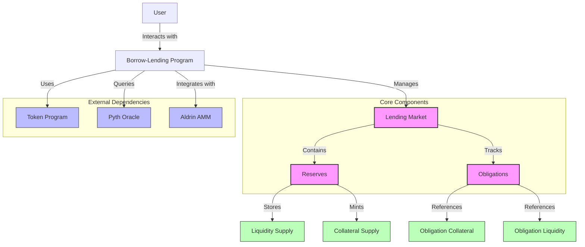

### Component Relationships
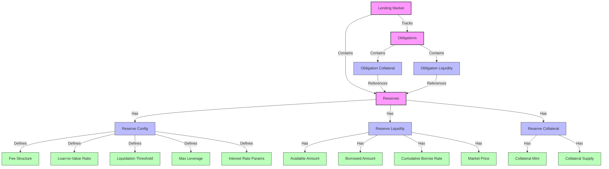

### Data Model Relationships
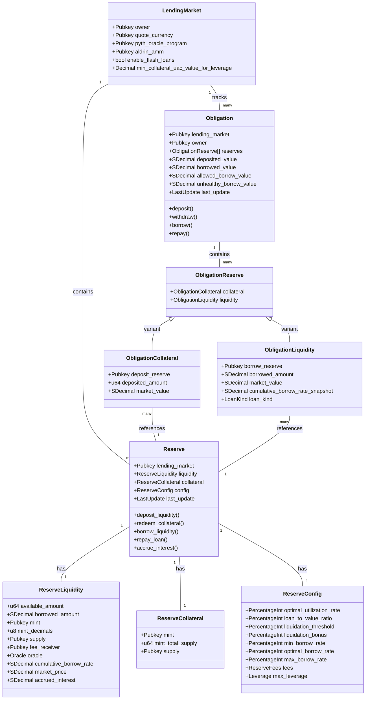

## Key Processes

### Lending and Borrowing Flows
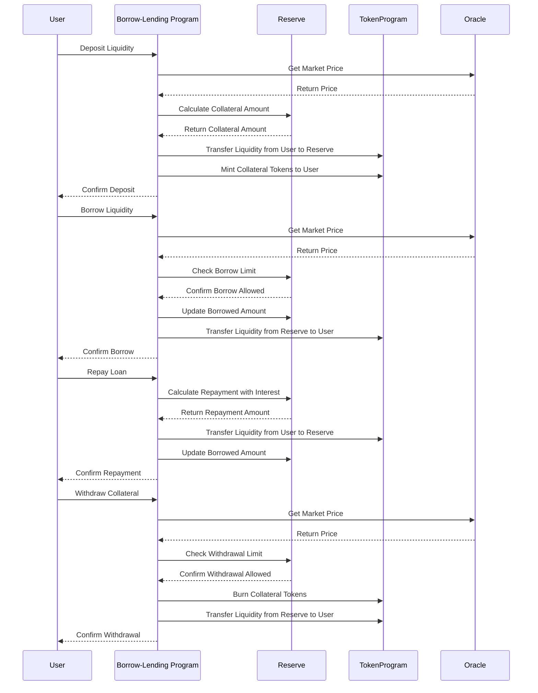

### Liquidation Flow
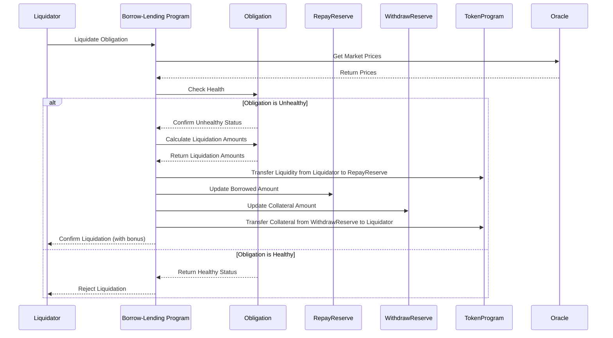

### Flash Loan Process
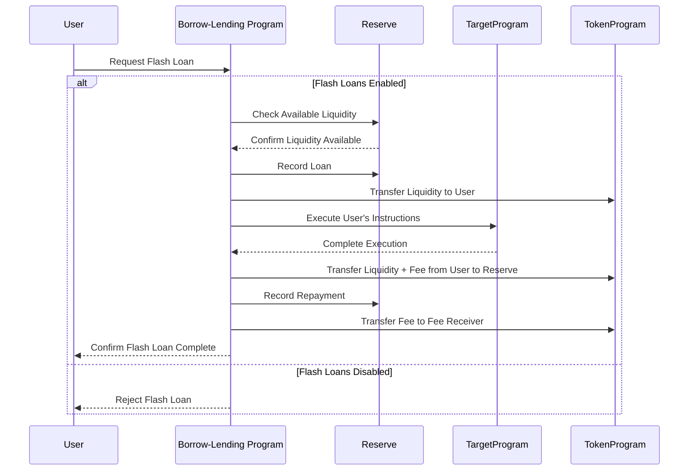

### Leveraged Yield Farming Flow
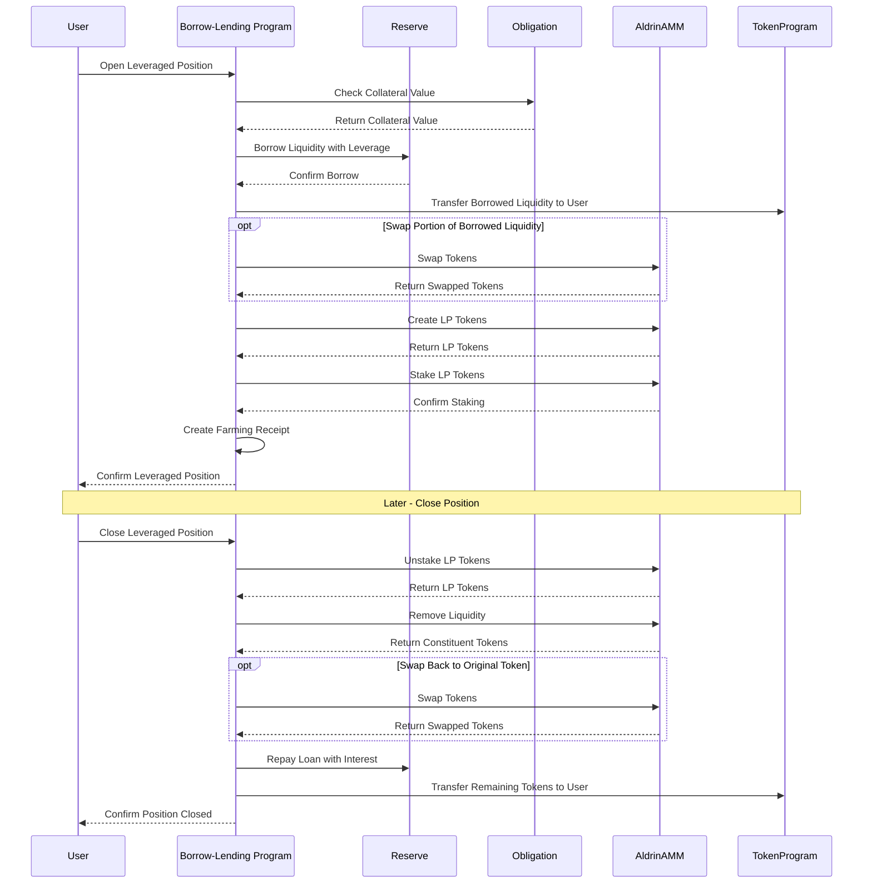

## Tokenomics

### Interest Rate Curves
```mermaid
graph LR
    subgraph "Interest Rate Model"
        direction TB
        
        U[Utilization Rate] --> |"R_u < R*_u"| L[Low Utilization Formula]
        U --> |"R_u >= R*_u"| H[High Utilization Formula]
        
        L --> BR[Borrow Rate]
        H --> BR
        
        BR --> |"R_d = R_u * R_b"| DR[Deposit Rate]
    end
    
    subgraph "Interest Rate Curve"
        direction TB
        
        style IRGraph fill:#f9f9f9,stroke:#333,stroke-width:1px
        
        IRGraph[
        "
        ^
        |                                   /
        |                                  /
        |                                 /
        |                                /
        |                               /
        |                              /
        |                             /
        |                            /
        |                           /
        |                          /
        |                         /
        |                        /
        |                       /
        |                      /
        |                     /
        |                    /
        |                   /
        |                  /
        |                 /
        |                /
        |               /
        |              /
        |             /
        |            /
        |           /
        |          /
        |         /
        |        /
        |       /
        |      /
        |     /
        |    /
        |   /
        |  /
        | /
        |/
        +---------------------------------->
          0%       R*_u       100%
          
          R_minb = Min Borrow Rate
          R*_b = Optimal Borrow Rate
          R_maxb = Max Borrow Rate
          R*_u = Optimal Utilization Rate
        "
        ]
    end
```

### Fee Distribution
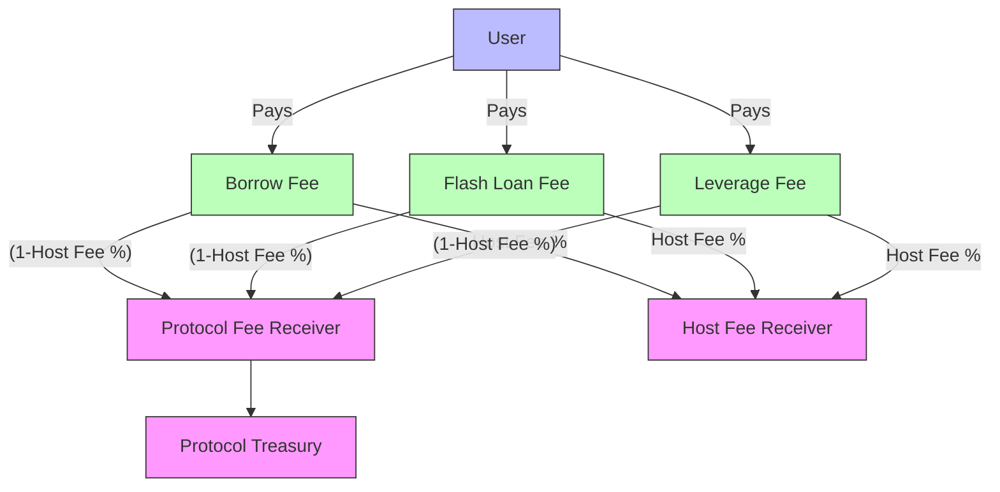

### Collateralization Model
```mermaid
graph TD
    subgraph "Collateralization Parameters"
        LTV[Loan-to-Value Ratio]
        LT[Liquidation Threshold]
        LB[Liquidation Bonus]
    end
    
    subgraph "Collateralization States"
        direction TB
        
        style CollateralGraph fill:#f9f9f9,stroke:#333,stroke-width:1px
        
        CollateralGraph[
        "
        Collateral Value
        ^
        |
        |                   Safe Zone
        |                   (Can borrow more)
        |                   
        |------------------+
        |                  |
        |                  | Warning Zone
        |                  | (Cannot borrow more)
        |                  |
        |------------------+
        |                  |
        |                  | Liquidation Zone
        |                  | (Can be liquidated)
        |                  |
        +------------------+---------------->
                           Borrowed Value
                           
        LTV = Maximum borrow amount relative to collateral
        LT = Threshold where liquidation becomes possible
        LB = Bonus liquidators receive (incentive)
        "
        ]
    end
    
    LTV --> CollateralGraph
    LT --> CollateralGraph
    LB --> CollateralGraph
```

### Emissions Flow
```mermaid
flowchart TD
    ER[Emission Rate] --> |"ω^b (Borrower Rate)"| BE[Borrower Emissions]
    ER --> |"ω^s (Supplier Rate)"| SE[Supplier Emissions]
    
    BE --> |"Based on Share of Borrowed Amount"| BU[Borrower Users]
    SE --> |"Based on Share of Supplied Amount"| SU[Supplier Users]
    
    subgraph "Emission Formula"
        direction TB
        
        style EmissionFormula fill:#f9f9f9,stroke:#333,stroke-width:1px
        
        EmissionFormula[
        "
        For Borrowers:
        E = ω^b * S_e * (L^u_b / L^r_b)
        
        For Suppliers:
        E = ω^s * S_e * (L^u_s / L^r_s)
        
        Where:
        E = Emission tokens a user can claim
        ω = Emitted tokens per slot
        S_e = Elapsed slots
        L^u_b = User's borrowed amount
        L^r_b = Reserve's total borrowed amount
        L^u_s = User's supplied amount
        L^r_s = Reserve's total supplied amount
        "
        ]
    end
    
    BE --> EmissionFormula
    SE --> EmissionFormula
    
    classDef rate fill:#bbf,stroke:#333,stroke-width:1px;
    classDef emission fill:#bfb,stroke:#333,stroke-width:1px;
    classDef user fill:#f9f,stroke:#333,stroke-width:1px;
    
    class ER rate;
    class BE,SE emission;
    class BU,SU user;
```

## Security Checkpoints

```mermaid
flowchart TD
    subgraph "Security Checkpoints"
        OS[Oracle Security]
        FS[Flash Loan Security]
        LS[Leverage Security]
        LQS[Liquidation Security]
        MS[Mathematical Security]
        AS[Access Control Security]
    end
    
    OS --> |"Check"| OSC1[Oracle Freshness]
    OS --> |"Check"| OSC2[Price Manipulation]
    OS --> |"Check"| OSC3[Oracle Dependency]
    
    FS --> |"Check"| FSC1[Reentrancy Protection]
    FS --> |"Check"| FSC2[Fee Calculation]
    FS --> |"Check"| FSC3[Repayment Verification]
    
    LS --> |"Check"| LSC1[Leverage Limits]
    LS --> |"Check"| LSC2[Token Leakage]
    LS --> |"Check"| LSC3[Position Ownership]
    
    LQS --> |"Check"| LQSC1[Liquidation Thresholds]
    LQS --> |"Check"| LQSC2[Liquidation Calculation]
    LQS --> |"Check"| LQSC3[Liquidation Incentives]
    
    MS --> |"Check"| MSC1[Decimal Precision]
    MS --> |"Check"| MSC2[Overflow/Underflow]
    MS --> |"Check"| MSC3[Rounding Errors]
    
    AS --> |"Check"| ASC1[Account Validation]
    AS --> |"Check"| ASC2[PDA Seed Construction]
    AS --> |"Check"| ASC3[Authority Verification]
    
    classDef category fill:#f9f,stroke:#333,stroke-width:2px;
    classDef check fill:#bbf,stroke:#333,stroke-width:1px;
    
    class OS,FS,LS,LQS,MS,AS category;
    class OSC1,OSC2,OSC3,FSC1,FSC2,FSC3,LSC1,LSC2,LSC3,LQSC1,LQSC2,LQSC3,MSC1,MSC2,MSC3,ASC1,ASC2,ASC3 check;
```

## Program Structure

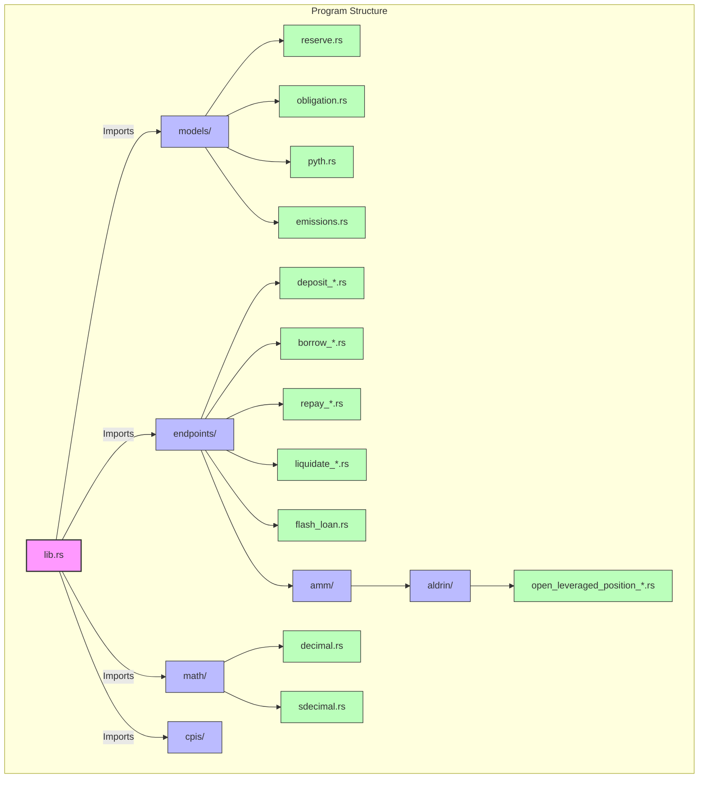

## Mathematical Models

### Interest Calculation Flow
```mermaid
flowchart TD
    BR[Borrow Rate Calculation] --> |"Input"| CI[Compound Interest Calculation]
    SE[Slots Elapsed] --> |"Input"| CI
    
    CI --> |"Updates"| BA[Borrowed Amount]
    CI --> |"Updates"| CBR[Cumulative Borrow Rate]
    
    subgraph "Compound Interest Formula"
        direction TB
        
        style Formula fill:#f9f9f9,stroke:#333,stroke-width:1px
        
        Formula[
        "
        R_i = (1 + R_b/S_a)^S_e
        
        Where:
        R_i = Compound interest rate
        R_b = Borrow rate
        S_a = Slots per year
        S_e = Elapsed slots
        
        New borrowed amount:
        L'_s = L_s * R_i
        
        New obligation borrowed amount:
        L'_o = (R'_c/R_c) * L_o
        
        Where:
        R'_c = New cumulative borrow rate
        R_c = Old cumulative borrow rate
        L_o = Old borrowed amount
        "
        ]
    end
    
    CI --> Formula
    
    classDef input fill:#bbf,stroke:#333,stroke-width:1px;
    classDef calculation fill:#f9f,stroke:#333,stroke-width:2px;
    classDef output fill:#bfb,stroke:#333,stroke-width:1px;
    
    class BR,SE input;
    class CI calculation;
    class BA,CBR output;
```

### Exchange Rate Mechanism
```mermaid
flowchart TD
    LS[Liquidity Supply] --> |"Input"| ER[Exchange Rate Calculation]
    CS[Collateral Supply] --> |"Input"| ER
    
    ER --> |"Used for"| LC[Liquidity to Collateral Conversion]
    ER --> |"Used for"| CL[Collateral to Liquidity Conversion]
    
    LC --> |"Used in"| Deposit[Deposit Operation]
    CL --> |"Used in"| Withdraw[Withdraw Operation]
    
    subgraph "Exchange Rate Formula"
        direction TB
        
        style Formula fill:#f9f9f9,stroke:#333,stroke-width:1px
        
        Formula[
        "
        R_x = C_s / L_s
        
        Where:
        R_x = Exchange rate
        C_s = Total minted collateral supply
        L_s = Total deposited liquidity supply
        
        Liquidity to Collateral:
        C = L * R_x
        
        Collateral to Liquidity:
        L = C / R_x
        "
        ]
    end
    
    ER --> Formula
    
    classDef input fill:#bbf,stroke:#333,stroke-width:1px;
    classDef calculation fill:#f9f,stroke:#333,stroke-width:2px;
    classDef conversion fill:#bfb,stroke:#333,stroke-width:1px;
    classDef operation fill:#fbb,stroke:#333,stroke-width:1px;
    
    class LS,CS input;
    class ER calculation;
    class LC,CL conversion;
    class Deposit,Withdraw operation;
```

### Liquidation Calculation
```mermaid
flowchart TD
    BV[Borrowed Value] --> |"Input"| LC[Liquidation Calculation]
    CV[Collateral Value] --> |"Input"| LC
    LT[Liquidation Threshold] --> |"Input"| LC
    LB[Liquidation Bonus] --> |"Input"| LC
    
    LC --> |"Output"| MLA[Max Liquidation Amount]
    LC --> |"Output"| SA[Settlement Amount]
    LC --> |"Output"| WA[Withdrawal Amount]
    
    subgraph "Liquidation Formula"
        direction TB
        
        style Formula fill:#f9f9f9,stroke:#333,stroke-width:1px
        
        Formula[
        "
        L_maxl = (min{V_b * κ, L_v} / L_v) * L_b
        
        Where:
        L_maxl = Maximum liquidity amount to liquidate
        V_b = UAC value of borrowed liquidity
        κ = Constant liquidity close factor (50%)
        L_v = UAC value of borrowed liquidity
        L_b = Total borrowed liquidity
        
        Liquidation value with bonus:
        LV = L * (1 + LB)
        
        Where:
        L = Liquidation amount
        LB = Liquidation bonus
        "
        ]
    end
    
    LC --> Formula
    
    classDef input fill:#bbf,stroke:#333,stroke-width:1px;
    classDef calculation fill:#f9f,stroke:#333,stroke-width:2px;
    classDef output fill:#bfb,stroke:#333,stroke-width:1px;
    
    class BV,CV,LT,LB input;
    class LC calculation;
    class MLA,SA,WA output;
```

### Leverage Calculation
```mermaid
flowchart TD
    LTV[Loan-to-Value Ratio] --> |"Input"| ML[Max Leverage Calculation]
    
    ML --> |"Limits"| LP[Leveraged Position]
    
    subgraph "Leverage Formula"
        direction TB
        
        style Formula fill:#f9f9f9,stroke:#333,stroke-width:1px
        
        Formula[
        "
        φ_max = (1 - V_maxb^30) / (1 - V_maxb)
        
        Where:
        φ_max = Maximum leverage
        V_maxb = Maximum borrowable UAC value (LTV)
        
        Leveraged borrow value:
        V_l = V_r * φ
        
        Where:
        V_l = Leveraged borrow value
        V_r = Regular borrow value
        φ = Leverage factor
        "
        ]
    end
    
    ML --> Formula
    
    classDef input fill:#bbf,stroke:#333,stroke-width:1px;
    classDef calculation fill:#f9f,stroke:#333,stroke-width:2px;
    classDef output fill:#bfb,stroke:#333,stroke-width:1px;
    
    class LTV input;
    class ML calculation;
    class LP output;
```

## Integration Diagrams

### Oracle Integration
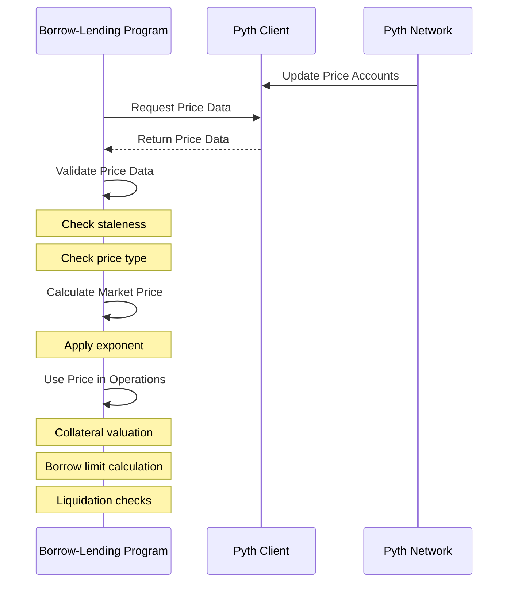

### AMM Integration
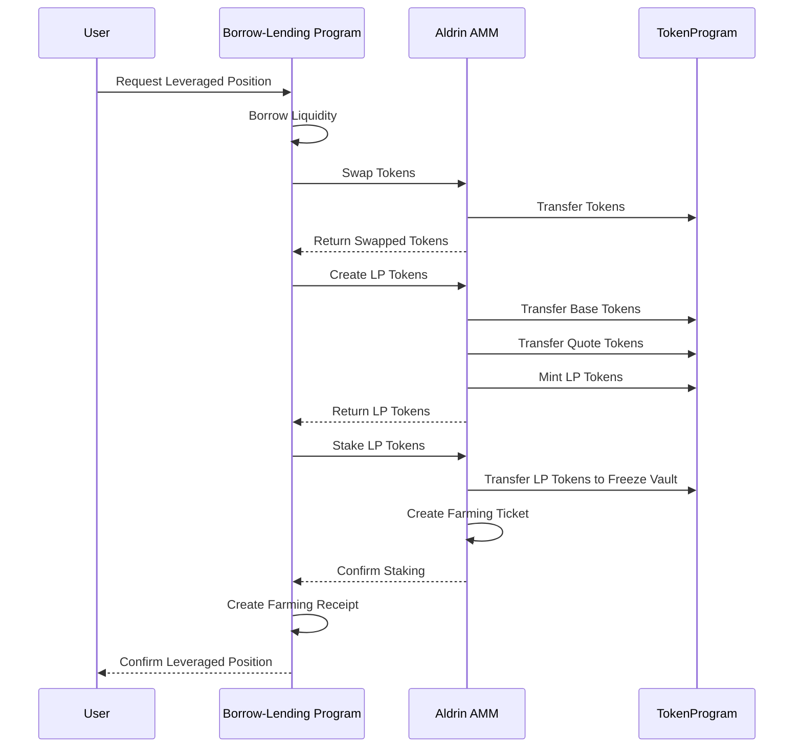

### Token Integration
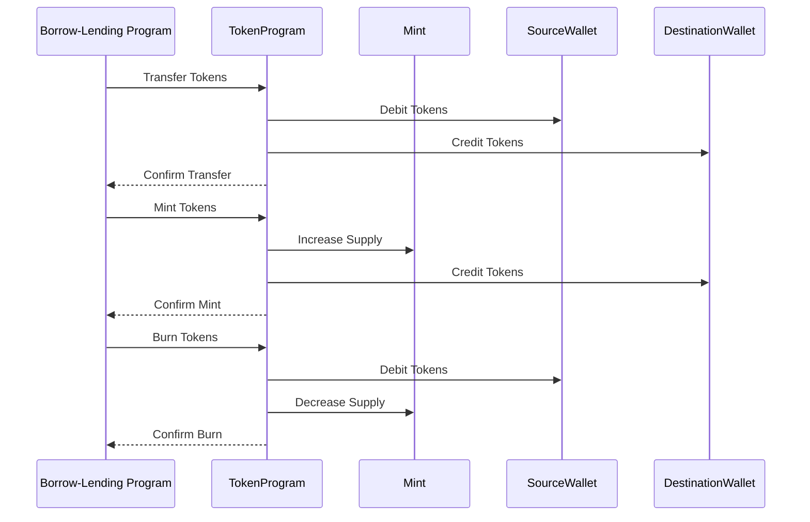

## Risk Management Framework
```mermaid
flowchart TD
    subgraph "Risk Categories"
        MR[Market Risk]
        LR[Liquidity Risk]
        OR[Oracle Risk]
        CR[Credit Risk]
        TR[Technical Risk]
    end
    
    MR --> |"Mitigated by"| MRM[Market Risk Mitigations]
    LR --> |"Mitigated by"| LRM[Liquidity Risk Mitigations]
    OR --> |"Mitigated by"| ORM[Oracle Risk Mitigations]
    CR --> |"Mitigated by"| CRM[Credit Risk Mitigations]
    TR --> |"Mitigated by"| TRM[Technical Risk Mitigations]
    
    MRM --> MRM1[Conservative LTV Ratios]
    MRM --> MRM2[Liquidation Incentives]
    MRM --> MRM3[Price Monitoring]
    
    LRM --> LRM1[Utilization Rate Caps]
    LRM --> LRM2[Dynamic Interest Rates]
    LRM --> LRM3[Reserve Requirements]
    
    ORM --> ORM1[Staleness Checks]
    ORM --> ORM2[Multiple Oracle Support]
    ORM --> ORM3[Circuit Breakers]
    
    CRM --> CRM1[Overcollateralization]
    CRM --> CRM2[Liquidation Thresholds]
    CRM --> CRM3[Risk-Based Parameters]
    
    TRM --> TRM1[Code Audits]
    TRM --> TRM2[Formal Verification]
    TRM --> TRM3[Upgrade Controls]
    
    classDef risk fill:#f9f,stroke:#333,stroke-width:2px;
    classDef mitigation fill:#bbf,stroke:#333,stroke-width:1px;
    classDef specific fill:#bfb,stroke:#333,stroke-width:1px;
    
    class MR,LR,OR,CR,TR risk;
    class MRM,LRM,ORM,CRM,TRM mitigation;
    class MRM1,MRM2,MRM3,LRM1,LRM2,LRM3,ORM1,ORM2,ORM3,CRM1,CRM2,CRM3,TRM1,TRM2,TRM3 specific;
```
